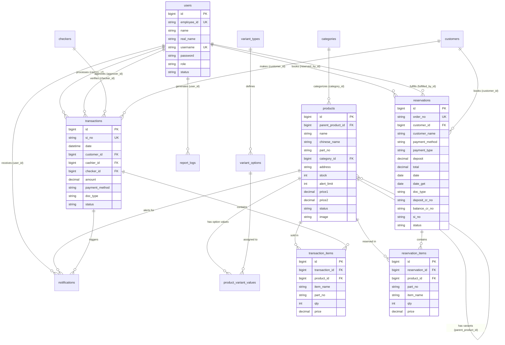

# ZTG Heavy Parts — ERD Database Schema & Documentation

> **Purpose:** Official ERD database schema and Lucid Chart AI prompt matching the production database migrations for **ZTG POS & Smart Inventory System**.

---

## Entity Definitions

### 1. `users`
Stores all system users (Admin, Cashier, Checker, Supervisor).

| Column | Type | Constraints | Notes |
|---|---|---|---|
| `id` | BIGINT UNSIGNED | PK, AUTO_INCREMENT | |
| `employee_id` | VARCHAR(20) | UNIQUE, NOT NULL | Format: `EMP-000`, `EMP-001` |
| `name` | VARCHAR(100) | NOT NULL | Display name |
| `real_name` | VARCHAR(100) | NOT NULL | Legal/real name |
| `email` | VARCHAR(255) | NULLABLE, UNIQUE | |
| `username` | VARCHAR(50) | UNIQUE, NOT NULL | Login username |
| `password` | VARCHAR(255) | NOT NULL | Hashed (bcrypt in Laravel) |
| `pin` | VARCHAR(10) | NULLABLE | Manager approval PIN |
| `role` | VARCHAR(50) | NOT NULL, DEFAULT 'Cashier' | Enum: 'Admin', 'Cashier', 'Supervisor' |
| `status` | VARCHAR(50) | NOT NULL, DEFAULT 'Active' | Enum: 'Active', 'Inactive' |
| `profile_photo` | VARCHAR(500) | NULLABLE | File path or Cloudinary/R2 URL |
| `created_at` | TIMESTAMP | DEFAULT CURRENT_TIMESTAMP | |
| `updated_at` | TIMESTAMP | ON UPDATE CURRENT_TIMESTAMP | |

---

### 2. `checkers`
Stores checker profiles assigned to sales transactions for supervisor verification.

| Column | Type | Constraints | Notes |
|---|---|---|---|
| `id` | BIGINT UNSIGNED | PK, AUTO_INCREMENT | |
| `name` | VARCHAR(100) | NOT NULL | Checker full name |
| `status` | VARCHAR(20) | NOT NULL, DEFAULT 'Active' | Enum: 'Active', 'Inactive' |
| `created_at` | TIMESTAMP | DEFAULT CURRENT_TIMESTAMP | |
| `updated_at` | TIMESTAMP | ON UPDATE CURRENT_TIMESTAMP | |

---

### 3. `categories`
Product categories managed from Settings.

| Column | Type | Constraints | Notes |
|---|---|---|---|
| `id` | BIGINT UNSIGNED | PK, AUTO_INCREMENT | |
| `name` | VARCHAR(100) | UNIQUE, NOT NULL | e.g. Hydraulics, Filters |
| `prefix` | VARCHAR(10) | NULLABLE | Category SKU prefix e.g. HYD, FIL |
| `chinese_name` | VARCHAR(100) | NULLABLE | Chinese category translation |
| `allow_variants` | BOOLEAN | NOT NULL, DEFAULT FALSE | Flag to enable variants for category |
| `created_at` | TIMESTAMP | DEFAULT CURRENT_TIMESTAMP | |
| `updated_at` | TIMESTAMP | ON UPDATE CURRENT_TIMESTAMP | |

---

### 4. `variant_types`
Defines variant dimensions (e.g. Size, Color, Voltage).

| Column | Type | Constraints | Notes |
|---|---|---|---|
| `id` | BIGINT UNSIGNED | PK, AUTO_INCREMENT | |
| `name` | VARCHAR(100) | UNIQUE, NOT NULL | e.g. "Size", "Material" |
| `created_at` | TIMESTAMP | DEFAULT CURRENT_TIMESTAMP | |

---

### 5. `variant_options`
Individual options within a variant type.

| Column | Type | Constraints | Notes |
|---|---|---|---|
| `id` | BIGINT UNSIGNED | PK, AUTO_INCREMENT | |
| `variant_type_id` | BIGINT UNSIGNED | FK → `variant_types.id`, NOT NULL | |
| `value` | VARCHAR(100) | NOT NULL | e.g. "Standard", "Heavy Duty", "300mm" |
| `created_at` | TIMESTAMP | DEFAULT CURRENT_TIMESTAMP | |

---

### 6. `products`
Master product catalog. Each variant is its own row (same `name`, different `variant_options`).

| Column | Type | Constraints | Notes |
|---|---|---|---|
| `id` | BIGINT UNSIGNED | PK, AUTO_INCREMENT | |
| `parent_product_id` | BIGINT UNSIGNED | FK → `products.id`, NULLABLE | NULL = base product; set for variants |
| `name` | VARCHAR(255) | NULLABLE | Product name (nullable for items with image/price only) |
| `chinese_name` | VARCHAR(255) | NULLABLE | Chinese translation |
| `part_no` | VARCHAR(50) | NULLABLE | Part number (nullable for unnumbered items) |
| `category_id` | BIGINT UNSIGNED | FK → `categories.id`, NOT NULL | |
| `address` | VARCHAR(50) | NULLABLE | Warehouse location: Rack A-1 |
| `stock` | INT | NOT NULL, DEFAULT 0 | Current shelf stock |
| `alert_limit` | INT | NOT NULL, DEFAULT 5 | Low stock threshold |
| `price1` | DECIMAL(12,2) | NOT NULL, DEFAULT 0 | Wholesale / Original price |
| `price2` | DECIMAL(12,2) | NOT NULL, DEFAULT 0 | Retail price |
| `status` | VARCHAR(50) | NOT NULL, DEFAULT 'Active' | Enum: 'Active', 'Low Stock', 'No Stock', 'Disabled' |
| `is_dead_stock` | BOOLEAN | DEFAULT FALSE | Flagged as dead stock |
| `damaged` | INT | NOT NULL, DEFAULT 0 | Units marked damaged |
| `variant_options` | VARCHAR(255) | NULLABLE | Display label e.g. "Heavy Duty" |
| `image` | VARCHAR(500) | NULLABLE | Cloudinary image URL. For variants (`parent_product_id IS NOT NULL`), if `NULL`, it dynamically inherits the base product's image via Eloquent accessor to save cloud storage. |
| `notes` | TEXT | NULLABLE | Internal notes |
| `created_at` | TIMESTAMP | DEFAULT CURRENT_TIMESTAMP | |
| `updated_at` | TIMESTAMP | ON UPDATE CURRENT_TIMESTAMP | |

---

### 7. `product_variant_values`
Junction table linking a product variant row to its variant option(s).

| Column | Type | Constraints | Notes |
|---|---|---|---|
| `id` | BIGINT UNSIGNED | PK, AUTO_INCREMENT | |
| `product_id` | BIGINT UNSIGNED | FK → `products.id`, NOT NULL | |
| `variant_option_id` | BIGINT UNSIGNED | FK → `variant_options.id`, NOT NULL | |

**UNIQUE** constraint on (`product_id`, `variant_option_id`).

---

### 8. `customers`
Extracted customer registry for transactions and reservations.

| Column | Type | Constraints | Notes |
|---|---|---|---|
| `id` | BIGINT UNSIGNED | PK, AUTO_INCREMENT | |
| `name` | VARCHAR(255) | NOT NULL | Customer name |
| `phone` | VARCHAR(30) | NULLABLE | Contact phone |
| `email` | VARCHAR(255) | NULLABLE | Contact email |
| `tin` | VARCHAR(30) | NULLABLE | Tax Identification Number |
| `address` | TEXT | NULLABLE | Billing / Delivery address |
| `created_at` | TIMESTAMP | DEFAULT CURRENT_TIMESTAMP | |
| `updated_at` | TIMESTAMP | ON UPDATE CURRENT_TIMESTAMP | |

---

### 9. `transactions`
Central sales and audit ledger for Sales, Refunds, Returns, Voids, Restocks, and Security Alerts.

| Column | Type | Constraints | Notes |
|---|---|---|---|
| `id` | BIGINT UNSIGNED | PK, AUTO_INCREMENT | |
| `si_no` | VARCHAR(50) | UNIQUE, NOT NULL, INDEX | Invoice number: `SI-2026-000001`, `DR-2026-000001`, `CR-2026-000001` |
| `or_no` | VARCHAR(50) | NULLABLE | Official receipt no. for refund/return/void |
| `date` | DATETIME | NOT NULL, INDEX | Transaction timestamp |
| `customer_id` | BIGINT UNSIGNED | FK → `customers.id`, NULLABLE, INDEX | |
| `cashier_id` | BIGINT UNSIGNED | FK → `users.id`, NOT NULL, INDEX | Cashier who processed |
| `checker_id` | BIGINT UNSIGNED | FK → `checkers.id`, NULLABLE, INDEX | Supervisor / Checker assigned |
| `total_qty` | INT | NOT NULL, DEFAULT 0 | Total item quantity |
| `amount` | DECIMAL(12,2) | NOT NULL, DEFAULT 0 | Current net transaction total (adjusted upon partial refund/void) |
| `original_amount` | DECIMAL(12,2) | NULLABLE | Frozen original sale amount at checkout (for net sales & refund auditing) |
| `refunded_amount` | DECIMAL(12,2) | NOT NULL, DEFAULT 0 | Cumulative total refunded amount |
| `discount_amount` | DECIMAL(12,2) | NOT NULL, DEFAULT 0 | Total discount amount applied |
| `discount_type` | VARCHAR(50) | NULLABLE | 'CustomAmount', 'CustomPercent' |
| `discount_rate` | DECIMAL(5,2) | NOT NULL, DEFAULT 0 | Discount rate percentage |
| `amount_tendered` | DECIMAL(12,2) | NULLABLE | Cash tendered |
| `payment_method` | VARCHAR(255) | NOT NULL | 'Cash', 'GCash', 'Bank Transfer', 'Cheque', 'P.O. (Pending)', 'Split' |
| `cheque_number` | VARCHAR(100) | NULLABLE | Reference number for cheque payments |
| `cheque_bank` | VARCHAR(100) | NULLABLE | Issuing bank name (e.g., BDO, Metrobank, BPI) |
| `cheque_date` | DATE | NULLABLE | Issue date / Maturity date of cheque |
| `doc_type` | VARCHAR(50) | NULLABLE | PHP Enum: `S.I.` (Sales Invoice), `D.R.` (Delivery Receipt), `C.R.` (Collection Receipt) |
| `status` | VARCHAR(50) | NOT NULL, INDEX | Enum: `Completed`, `Refund`, `Return`, `Void`, `Pending`, `Deposit`, `Paid`, `Restocked`, `Damaged`, `Security Alert` |
| `type` | VARCHAR(50) | NULLABLE | Enum: `sale`, `reservation`, `inventory`, `system` |
| `refund_reason` | VARCHAR(255) | NULLABLE | Reason for refund/return |
| `void_reason` | VARCHAR(255) | NULLABLE | Reason for void |
| `action_type` | VARCHAR(100) | NULLABLE | e.g. "Refunded via Cash" |
| `inv_action` | VARCHAR(100) | NULLABLE | e.g. "Restocked to Shelf" |
| `approver_id` | BIGINT UNSIGNED | FK → `users.id`, NULLABLE | Admin who approved action |
| `approval_code` | VARCHAR(20) | NULLABLE | PIN used for approval |
| `order_ref` | VARCHAR(50) | NULLABLE | FK reference to reservation `ORD-XXX` / `RS-XXX` |
| `business_snapshot` | TEXT / JSON | NULLABLE | Frozen snapshot of business header details |
| `internal_notes` | TEXT | NULLABLE | Internal notes |
| `created_at` | TIMESTAMP | DEFAULT CURRENT_TIMESTAMP | |
| `updated_at` | TIMESTAMP | ON UPDATE CURRENT_TIMESTAMP | |

**Compound Indexes:**
- `INDEX (date, status)` — for fast date-filtered sales summary and report generation
- `INDEX (customer_id, date)` — for customer purchase histories
- `INDEX (cashier_id, date)` — for cashier daily sales reconciliation

---

### 10. `transaction_items`
Line items for each sales transaction or inventory adjustment.

| Column | Type | Constraints | Notes |
|---|---|---|---|
| `id` | BIGINT UNSIGNED | PK, AUTO_INCREMENT | |
| `transaction_id` | BIGINT UNSIGNED | FK → `transactions.id`, NOT NULL, ON DELETE CASCADE | |
| `product_id` | BIGINT UNSIGNED | FK → `products.id`, NULLABLE, ON DELETE SET NULL | Product foreign key |
| `item_name` | VARCHAR(255) | NULLABLE | Frozen product name snapshot |
| `part_no` | VARCHAR(100) | NULLABLE | Frozen part number snapshot |
| `qty` | INT | NOT NULL | Original quantity purchased |
| `refunded_qty` | INT | NOT NULL, DEFAULT 0 | Cumulative units refunded / returned |
| `price` | DECIMAL(12,2) | NOT NULL | Unit price after item discount |
| `original_price` | DECIMAL(12,2) | NOT NULL, DEFAULT 0 | Base catalog price |
| `discount` | DECIMAL(12,2) | NOT NULL, DEFAULT 0 | Item-level discount amount |
| `price_tier` | VARCHAR(50) | DEFAULT 'price1' | PHP Enum: `price1` (Wholesale), `price2` (Retail) |
| `unit` | VARCHAR(20) | DEFAULT 'pc' | Unit of measure |
| `created_at` | TIMESTAMP | DEFAULT CURRENT_TIMESTAMP | |

---

### 11. `reservations`
Order-based reservations with multi-item cart support, Collection Receipt fulfillment, and vehicle tracking.

| Column | Type | Constraints | Notes |
|---|---|---|---|
| `id` | BIGINT UNSIGNED | PK, AUTO_INCREMENT | |
| `order_no` | VARCHAR(50) | UNIQUE, NOT NULL | Format: `RS-YYYY-XXX` |
| `customer_id` | BIGINT UNSIGNED | FK → `customers.id`, NULLABLE, ON DELETE SET NULL | Customer reference |
| `customer_name` | VARCHAR(100) | NULLABLE | Customer display name |
| `customer_phone` | VARCHAR(50) | NULLABLE | Customer contact phone |
| `email` | VARCHAR(255) | NULLABLE | Customer email |
| `engine_plate_number`| VARCHAR(100) | NULLABLE | Target vehicle/engine plate number |
| `notes` | TEXT | NULLABLE | Special instructions |
| `payment_method` | VARCHAR(50) | NOT NULL | 'Cash', 'GCash', 'Bank Transfer', 'Cheque' |
| `cheque_number` | VARCHAR(100) | NULLABLE | Cheque reference number |
| `cheque_bank` | VARCHAR(100) | NULLABLE | Cheque issuing bank |
| `cheque_date` | DATE | NULLABLE | Cheque issue / maturity date |
| `payment_type` | VARCHAR(50) | NOT NULL | PHP Enum: `deposit50`, `full` |
| `deposit` | DECIMAL(12,2) | NOT NULL, DEFAULT 0 | Deposit amount paid |
| `total` | DECIMAL(12,2) | NOT NULL, DEFAULT 0 | Order total amount |
| `date` | DATE | NOT NULL | Reservation date |
| `pickup_date` | DATE | NULLABLE | Expected pickup date |
| `pickup_time` | TIME | NULLABLE | Expected pickup time |
| `date_get` | DATE | NULLABLE | Actual item fulfillment / claim date |
| `doc_type` | VARCHAR(20) | DEFAULT 'C.R.' | Document type: 'C.R.' (Collection Receipt), 'S.I.', 'D.R.' |
| `deposit_cr_no` | VARCHAR(50) | NULLABLE | Physical Collection Receipt No. (C.R. No.) issued upon initial booking deposit |
| `balance_cr_no` | VARCHAR(50) | NULLABLE | Physical Collection Receipt No. (C.R. No.) issued upon order fulfillment/balance payment |
| `si_no` | VARCHAR(50) | NULLABLE | Physical Collection Receipt No. (C.R. No.) from booklet (backward compatible alias) |
| `reserved_by_id` | BIGINT UNSIGNED | FK → `users.id`, NOT NULL | Cashier who booked |
| `fulfilled_by_id` | BIGINT UNSIGNED | FK → `users.id`, NULLABLE | Cashier who fulfilled |
| `status` | VARCHAR(50) | NOT NULL, DEFAULT 'Pending' | PHP Enum: `Pending`, `Completed`, `Cancelled` |
| `created_at` | TIMESTAMP | DEFAULT CURRENT_TIMESTAMP | |
| `updated_at` | TIMESTAMP | ON UPDATE CURRENT_TIMESTAMP | |

---

### 12. `reservation_items`
Line items within a reservation order.

| Column | Type | Constraints | Notes |
|---|---|---|---|
| `id` | BIGINT UNSIGNED | PK, AUTO_INCREMENT | |
| `reservation_id` | BIGINT UNSIGNED | FK → `reservations.id`, ON DELETE CASCADE | |
| `product_id` | BIGINT UNSIGNED | FK → `products.id`, NULLABLE, ON DELETE SET NULL | |
| `part_no` | VARCHAR(100) | NULLABLE | Product part number |
| `item_name` | VARCHAR(255) | NULLABLE | Product name |
| `engine_plate_number`| VARCHAR(100) | NULLABLE | Specific vehicle/engine plate number per item |
| `qty` | INT | NOT NULL | Quantity reserved |
| `price` | DECIMAL(12,2) | NOT NULL | Unit price |

---

### 13. `report_logs`
Audit log recording report generation and export events.

| Column | Type | Constraints | Notes |
|---|---|---|---|
| `id` | BIGINT UNSIGNED | PK, AUTO_INCREMENT | |
| `user_id` | BIGINT UNSIGNED | FK → `users.id`, NULLABLE | User who generated report |
| `report_type` | VARCHAR(50) | NOT NULL | 'sales', 'product', 'payment', 'china_export' |
| `timeframe` | VARCHAR(50) | NOT NULL | 'today', 'thismonth', 'thisyear', 'custom' |
| `created_at` | TIMESTAMP | DEFAULT CURRENT_TIMESTAMP | |

---

### 14. `notifications`
System-generated alerts (low stock, transactions, reservations).

| Column | Type | Constraints | Notes |
|---|---|---|---|
| `id` | BIGINT UNSIGNED | PK, AUTO_INCREMENT | |
| `type` | VARCHAR(50) | NOT NULL | 'low_stock', 'transaction', 'reservation' |
| `sub_type` | VARCHAR(50) | NULLABLE | 'sale', 'refund', 'void', 'inventory_restock' |
| `title` | VARCHAR(255) | NOT NULL | Alert title |
| `message` | TEXT | NOT NULL | Detailed message |
| `link` | VARCHAR(255) | NULLABLE | Page route link |
| `product_id` | BIGINT UNSIGNED | FK → `products.id`, NULLABLE | |
| `transaction_id` | BIGINT UNSIGNED | FK → `transactions.id`, NULLABLE | |
| `is_read` | BOOLEAN | DEFAULT FALSE | Read indicator |
| `user_id` | BIGINT UNSIGNED | FK → `users.id`, NULLABLE | Target user |
| `created_at` | TIMESTAMP | DEFAULT CURRENT_TIMESTAMP | |

---

### 15. `settings`
Key-value store for system configuration settings.

| Column | Type | Constraints | Notes |
|---|---|---|---|
| `id` | BIGINT UNSIGNED | PK, AUTO_INCREMENT | |
| `key` | VARCHAR(100) | UNIQUE, NOT NULL | `business_name`, `business_address`, `tin`, `daily_void_limit`, etc. |
| `value` | TEXT | NULLABLE | Config value |
| `updated_at` | TIMESTAMP | ON UPDATE CURRENT_TIMESTAMP | |

---

## Visual Mermaid ERD



---

## Lucid Chart AI Prompt

> Copy and paste the prompt below into **Lucid Chart AI** to auto-generate the complete ERD diagram:

```
Create an Entity Relationship Diagram for a POS and Inventory Management System called "ZTG Heavy Parts" with these tables and relationships:

TABLES:
- users (id PK, employee_id UNIQUE, name, real_name, email, username UNIQUE, password, pin, role, status, profile_photo, timestamps)
- checkers (id PK, name, status, timestamps)
- categories (id PK, name UNIQUE, prefix, chinese_name, allow_variants BOOL, timestamps)
- variant_types (id PK, name UNIQUE, created_at)
- variant_options (id PK, variant_type_id FK->variant_types, value, created_at)
- products (id PK, parent_product_id FK->products NULLABLE self-ref, name NULLABLE, chinese_name, part_no NULLABLE, category_id FK->categories, address, stock INT, alert_limit INT, price1 DECIMAL, price2 DECIMAL, status, is_dead_stock BOOL, damaged INT, variant_options VARCHAR, image VARCHAR, notes TEXT, timestamps)
- product_variant_values (id PK, product_id FK->products, variant_option_id FK->variant_options, UNIQUE[product_id+variant_option_id])
- customers (id PK, name, phone, email, tin, address, timestamps)
- transactions (id PK, si_no UNIQUE, or_no, date DATETIME, customer_id FK->customers, cashier_id FK->users, checker_id FK->checkers, total_qty INT, amount DECIMAL, original_amount DECIMAL, refunded_amount DECIMAL, discount_amount DECIMAL, discount_type, discount_rate DECIMAL, amount_tendered DECIMAL, payment_method, cheque_number, cheque_bank, cheque_date DATE, doc_type, status, type, refund_reason, void_reason, action_type, inv_action, approver_id FK->users NULLABLE, approval_code, order_ref, business_snapshot TEXT, internal_notes TEXT, timestamps)
- transaction_items (id PK, transaction_id FK->transactions CASCADE, product_id FK->products, item_name, part_no, qty INT, refunded_qty INT, price DECIMAL, original_price DECIMAL, discount DECIMAL, price_tier, unit VARCHAR, created_at)
- reservations (id PK, order_no UNIQUE, customer_id FK->customers, customer_name, customer_phone, email, engine_plate_number, notes TEXT, payment_method, cheque_number, cheque_bank, cheque_date DATE, payment_type, deposit DECIMAL, total DECIMAL, date DATE, pickup_date DATE, pickup_time TIME, date_get DATE, doc_type DEFAULT 'C.R.', deposit_cr_no VARCHAR(50), balance_cr_no VARCHAR(50), si_no VARCHAR(50), reserved_by_id FK->users, fulfilled_by_id FK->users NULLABLE, status, timestamps)
- reservation_items (id PK, reservation_id FK->reservations CASCADE, product_id FK->products, part_no, item_name, engine_plate_number, qty INT, price DECIMAL)
- report_logs (id PK, user_id FK->users NULLABLE, report_type, timeframe, created_at)
- notifications (id PK, type, sub_type, title, message TEXT, link, product_id FK->products NULLABLE, transaction_id FK->transactions NULLABLE, is_read BOOL, user_id FK->users NULLABLE, created_at)
- settings (id PK, key UNIQUE, value TEXT, updated_at)

RELATIONSHIPS:
- users 1:M transactions (cashier_id)
- users 1:M transactions (approver_id)
- users 1:M reservations (reserved_by_id)
- users 1:M reservations (fulfilled_by_id)
- users 1:M report_logs (user_id)
- checkers 1:M transactions (checker_id)
- categories 1:M products (category_id)
- products 1:M products (self-ref parent_product_id for variants)
- products M:M variant_options (through product_variant_values)
- variant_types 1:M variant_options (variant_type_id)
- customers 1:M transactions (customer_id)
- customers 1:M reservations (customer_id)
- transactions 1:M transaction_items (transaction_id)
- products 1:M transaction_items (product_id)
- reservations 1:M reservation_items (reservation_id)
- products 1:M reservation_items (product_id)

Use crow's foot notation. Group related tables visually.
```
