# ZTG Heavy Parts — Complete Development Blueprint

> **One document, three sections.** Development Roadmap → Module Logic & Flows → Visual Diagrams.  
> Use this as your master reference when building the **Laravel + React + MySQL** production system.

---

# ═══════════════════════════════════════════════
# ARCHITECTURE & CODING STANDARDS
# ═══════════════════════════════════════════════

Use a **Layered Architecture** with thin controllers and thin services following Laravel best practices.

### Core Architecture Requirements:
- **Thin Controllers:** Controllers only receive Form Requests, call a dedicated Service method, and return JSON responses. Target length: < 30 lines per method.
- **Form Requests:** Use Form Request classes (`app/Http/Requests`) for all incoming parameter and body validation.
- **Fail-Fast Guard Clauses:** Place all validation checks as guard clauses at the **top** of service methods before executing business logic, loops, or DB transactions. Keep maximum nesting depth ≤ 3 levels.
- **Single-Pass Data Processing:** Never iterate over collections multiple times. Use dedicated processor classes and DTOs (e.g. `CartProcessor`, `CartItemDTO`) to validate, calculate, and prepare records in a single O(n) pass.
- **Bulk Database Operations & N+1 Prevention:** Never call `Model::find()` inside loops. Use `whereIn()` and `Collection::keyBy('id')` for O(1) in-memory lookups, and use `createMany()` / bulk updates.
- **Constants Classes:** Magic numbers and hardcoded strings are forbidden in service classes. Group them in `app/Services/Constants/` (e.g., `SecurityConstants`, `InvoiceConstants`, `StockConstants`) and `frontend/src/config/constants.js`.
- **Database Transactions:** Wrap critical data-mutating operations (checkout, inventory updates, refunds, voids) in atomic database transactions (`DB::transaction()`).
- **User & Profile Architecture (3NF):** Maintain strict separation between `users` (credentials, role, status, hashed PIN, email verification) and `user_profiles` (full name, phone, email, avatar). Always use the 1:1 `User hasOne UserProfile` relationship.
- **Frontend Hook Decomposition:** When a React hook exceeds ~200 lines, decompose it into focused sub-hooks (e.g. `usePOS` decomposes into `usePOSProducts`, `usePOSCart`, `usePOSCustomer`) composed by a thin root orchestrator.
- **Clean UI Standards:** Never use raw unicode emojis (`✋`, `ℹ️`, `⚠️`, `💡`, `🎉`) in production UI. Always use clean, professional inline vector SVGs with consistent stroke widths (`strokeWidth="2"`).

---

# ═══════════════════════════════════════════════
# PART 1: DEVELOPMENT ROADMAP
# ═══════════════════════════════════════════════

> Build in this exact order. Each phase depends on the previous one. **Test after every phase.**

---

## Phase 1 — Foundation (Database + Auth + Layout)

> **Goal:** A working login, role-based redirect, and sidebar shell. Nothing else yet.

### Build Order:
1. **Laravel Project Setup** → `laravel new ztg-pos`, configure `.env` for MySQL
2. **Database Migrations** → Run in this order (foreign keys depend on earlier tables):
   - `users` → employees/auth (seed `EMP-000` Administrator)
   - `categories` → product categories
   - `settings` → key-value config store
3. **Auth System** → Laravel Sanctum + login/logout API
4. **React Project Setup** → Vite + React Router
5. **Login Page** → POST `/api/login`, store token, redirect by role
6. **Layout Shell** → Sidebar component with role-based nav items
7. **RBAC Middleware** → Laravel middleware to check `Admin`, `Cashier`, etc.

### ✅ Test Checkpoint:
- [ ] Can login as Admin → see Dashboard shell with full sidebar
- [ ] Can login as Cashier → see POS shell with limited sidebar  
- [ ] Invalid credentials → error message
- [ ] No token → redirected to login

---

## Phase 2 — Settings Module (Configuration First)

> **Why first?** Every other module reads from settings (categories, tax rate, pricing labels, stock thresholds). Build the config layer before anything depends on it.

### Build Order:
1. **Settings API** → CRUD for `settings` table (key-value pairs)
2. **Category Management** → CRUD for `categories` table
3. **Variant Types & Options** → CRUD for `variant_types` + `variant_options`
4. **Employee Management** → CRUD for `users` (Admin only)
5. **Profile Page** → Edit own profile, change password (all roles)
6. **Alert Rules** → CRUD for `alert_rules` table
7. **Settings React Page** → Tabs: General, Products, Employees, Alerts, Profile

### Key Settings to Seed:
```
business_name       = "ZTG Heavy Parts"
tax_rate            = 12
low_stock_threshold = 5
currency            = "PHP"
price1_label        = "Original Price"
price2_label        = "Retail Price"
auto_deduct_stock   = true
```

### ✅ Test Checkpoint:
- [ ] Can add/edit/delete categories (Hydraulics, Filters, Engine, etc.)
- [ ] Can add/edit employees with roles and PINs
- [ ] Can change business name, tax rate → persists on reload
- [ ] Cashier can only see Profile tab, not Employee Management

---

## Phase 3 — Product Management Module

> **Why second?** POS, Inventory, and Reservations all read from the products table. You need products to exist before you can sell them.

### Build Order:
1. **Products Migration** → `products` table with self-referencing `parent_product_id`
2. **Product Variant Values** → `product_variant_values` junction table
3. **Product Model** → Eloquent with `category`, `parent`, `variants` relationships
4. **Product CRUD API** → Create, Read, Update, Delete + variant handling
5. **Product Management React Page** → Product table, Add/Edit modals
6. **Variant System** → When adding a product with variants, save base + variant rows
7. **Restock Workflow** → Full-screen restock mode with draft auto-save
8. **Damaged Stock Logging** → Modal to log damaged units + create inventory transaction
9. **Customers Migration** → `customers` table (needed for Phase 4)

### ✅ Test Checkpoint:
- [ ] Can add a product without variants → appears in table
- [ ] Can add a product WITH variants → creates base + variant rows
- [ ] Can edit product name, price, stock → persists
- [ ] Can restock: enter qty per product → stock increases, transaction logged
- [ ] Can log damaged stock → stock decreases, damaged count increases, transaction logged
- [ ] Product status auto-updates: Active / Low Stock / No Stock

---

## Phase 4 — POS / Checkout Module

> **Why third?** This is the core revenue flow. Everything after this (refund, void, reports) depends on completed sales existing in the transactions table.

### Build Order:
1. **Transactions Migration** → `transactions` + `transaction_items` tables
2. **Pending PO Migration** → `pending_purchase_orders` + `pending_po_items`
3. **POS Product Grid/Table** → Fetch products, display with stock levels
4. **Cart System** → Add to cart, adjust qty, remove, price tier toggle
5. **Checkout Review Modal** → Customer info, payment method, doc type
6. **Payment Processing Logic:**
   - Cash → validate tendered >= total, calculate change
   - GCash / Bank → auto-set tendered = total
   - Split → validate sum of 2 methods = total
7. **processDirectCheckout API** → Stock deduction + transaction creation
8. **Receipt Generation** → Server-side PDF (DomPDF) with BIR/EOPT format
9. **Pending PO System** → Park/resume orders

### ✅ Test Checkpoint:
- [ ] Can add products to cart → qty adjusts, total updates
- [ ] Cash checkout → stock deducted, transaction logged, receipt generated
- [ ] Split payment → validates both amounts sum to total
- [ ] Insufficient stock → blocked with error
- [ ] Transaction appears in DB with correct status "Completed"

---

## Phase 5 — History Logs (Refund / Return / Void)

> **Why fourth?** Post-sale operations. Requires completed transactions from Phase 4 to exist.

### Build Order:
1. **Transaction List Page** → Filterable table of all transactions
2. **Refund Modal** → Select items, choose reason, approve with PIN
3. **Return Modal** → Same flow, different status outcome
4. **Void Modal** → Voids entire transaction, admin PIN required
5. **PIN Validation Service** → Verify admin/supervisor PIN, log failures
6. **Stock Restoration Logic** → Re-add stock on refund/void
7. **Damaged Mark Logic** → Move refunded items to damaged count
8. **Daily Void Limit** → Configurable max voids per day
9. **Audit Detail Modal** → Full transaction history view
10. **OR Generation** → Official Receipt for refund/return/void

### ✅ Test Checkpoint:
- [ ] Can refund a completed sale → stock restored, status = "Refund"
- [ ] Can return an item → status = "Return", OR generated
- [ ] Can void transaction → all stock restored, status = "Void"
- [ ] Wrong PIN → blocked, security alert logged in transactions
- [ ] Daily void limit exceeded → operation blocked

---

## Phase 6 — Reservations Module

> **Why fifth?** Reservations create their own transactions (Deposit/Paid) and need stock deduction on fulfillment. Depends on products + transactions infrastructure.

### Build Order:
1. **Reservations Migration** → `reservations` + `reservation_items` tables
2. **Archives Migration** → `archives` table (for cancelled orders)
3. **Reservation List Page** → Table with status badges (Pending/Completed)
4. **Create Reservation Modal** → Product search cart, customer info, payment type
5. **handleAddReservation API** → Save reservation + deposit transaction
6. **Fulfill Reservation Modal** → Balance payment, doc type, stock deduction
7. **completeReservation API** → Deduct stock, create completion transaction
8. **Cancel Reservation Flow** → Archive record, remove from active list
9. **Receipt Generation** → Deposit receipt + fulfillment invoice

### ✅ Test Checkpoint:
- [ ] Admin can create reservation with 50% deposit → status "Pending"
- [ ] Cashier can create reservation with full payment → status "Pending"
- [ ] Can fulfill: balance paid, stock deducted, status → "Completed"
- [ ] Can cancel: archived, removed from active list
- [ ] Insufficient stock on fulfill → blocked

---

## Phase 7 — Reports, Dashboard, Logs & Notifications

> **Why last?** These are read-only aggregation views that depend on all the data created in Phases 3-6.

### Build Order:
1. **Dashboard** → KPI cards (total products, sales today, low stock, pending orders)
2. **Sales Log (Admin)** → All transactions with date/cashier filters
3. **Daily Sales (Cashier)** → Own transactions today only
4. **Customer Log** → Unique customers from transaction history
5. **Inventory Page** → Read-only stock overview with category/status filters
6. **Reports & Analytics** → Sales summary, product performance, cashier performance
7. **Notifications Migration** → `notifications` table
8. **Notification System** → Laravel Events + Broadcasting + React bell component
9. **Low Stock Alerts** → Auto-generate when product stock <= threshold
10. **Transaction Alerts** → Notify on new sale, refund, void, restock

### ✅ Test Checkpoint:
- [ ] Dashboard shows correct KPIs from real data
- [ ] Reports aggregate sales by cashier, product, date range
- [ ] Notification bell shows unread count
- [ ] Low stock product triggers notification
- [ ] New sale triggers real-time toast notification

---

## Phase 8 — Partial Refund & Net Sales Engine (Financial Accuracy & Auditing)

> **Why eighth?** In retail heavy parts, customers frequently return only a portion of their order (e.g., 1 damaged gasket out of 5 purchased). A full transaction cancellation would wipe out valid revenue. This phase guarantees exact mathematical net sales, frozen historical audit amounts, and real-time inventory restock options.

### Build Order:
1. **Schema Enhancements:**
   - Add `original_amount` (DECIMAL 12,2) to `transactions` (frozen gross total at checkout).
   - Add `refunded_amount` (DECIMAL 12,2, default 0) to `transactions` (tracks cumulative refunds).
   - Add `refunded_qty` (INT, default 0) to `transaction_items` (tracks cumulative returned units).
   - Add `cheque_number`, `cheque_bank`, `cheque_date` to `transactions` and `reservations`.
   - Add compound indexes: `INDEX (date, status)`, `INDEX (customer_id, date)`, `INDEX (cashier_id, date)`.
2. **TransactionService Refactoring:**
   - Update `processRefundOrReturn` to support partial quantity refunds per line item.
   - Freeze `original_amount` on initial creation and never overwrite it.
   - Increment `refunded_amount` by the refund subtotal (with VAT adjustments).
   - Update transaction net `amount` = `original_amount - refunded_amount`.
   - Update `transaction_items.refunded_qty` cumulatively.
   - Support multiple sequential partial refunds against the same transaction until `refunded_qty == qty`.
3. **ReportService Net Sales Engine:**
   - Update `getSalesSummary` to calculate revenue from net active sales (`amount` for active transactions).
   - Exclude 100% refunded / voided transactions from net revenue and item sold counts.
   - Include partially refunded transactions with their net remaining revenue and net remaining items (`qty - refunded_qty`).
   - Flag partial refunds in transaction listings (`is_partial_refund = true`, `net_qty`).
   - Update `getProductPerformance` (Top Sellers & Top Categories) to compute sales counts and revenue net of refunded quantities.
4. **Frontend History Logs & Sales Reports:**
   - Update `RefundModal` with item-by-item quantity spinners (max allowable = `qty - refunded_qty`).
   - Live calculate refund total and show net remaining balance before submission.
   - Show `Partial Refund` badge and breakdown in `HistoryTable`, `SalesTable`, `TransactionDetailsModal`, and `SalesReportTab`.
5. **Phase 8 Test Suite:**
   - Comprehensive feature test `PhaseEightTest.php` covering full refunds, partial refunds, mixed scenarios, frozen `original_amount`, sequential partial refunds, and product performance net calculations.

### ✅ Test Checkpoint:
- [ ] 100 sold, 90 refunded → Sales Report shows ₱5,000 net revenue and 10 items sold.
- [ ] Full refund → ₱0 revenue and 0 items counted in Sales Report; transaction stays in History Log for audit.
- [ ] Multiple sequential refunds on single transaction accumulate accurately without race conditions.
- [ ] Top Sellers & Top Categories reflect net units sold and net revenue.
- [ ] All 10 tests in `PhaseEightTest` pass.

---

## Phase Summary Timeline

| Phase | Module | Depends On | Est. Duration |
|---|---|---|---|
| 1 | Foundation (DB + Auth + Layout) | Nothing | 3-5 days |
| 2 | Settings & Configuration | Phase 1 | 3-4 days |
| 3 | Product Management | Phase 2 | 5-7 days |
| 4 | POS / Checkout | Phase 3 | 5-7 days |
| 5 | History Logs (Refund/Return/Void) | Phase 4 | 4-6 days |
| 6 | Reservations | Phase 3, 4 | 4-6 days |
| 7 | Reports, Dashboard, Notifications | Phase 3, 4, 5, 6 | 5-7 days |
| 8 | Partial Refund & Net Sales Engine | Phase 4, 5, 7 | 4-5 days |
| — | **Total Estimated** | — | **33-47 days** |

---
---

# ═══════════════════════════════════════════════
# PART 2: MODULE-BY-MODULE LOGIC & FLOWS
# ═══════════════════════════════════════════════

---

## Module A: Authentication & Authorization

### Login Logic
```
INPUT:  login_id (username, email, or phone_number), password
QUERY:  SELECT * FROM users JOIN user_profiles WHERE (username = ? OR email = ? OR phone_number = ?) AND status = 'Active'
CHECK:  Hash::check(password, user.password)
OUTPUT: { token, user: { id, full_name, phone_number, email, username, role, profile_photo } }
REDIRECT:
  - Admin/Supervisor → /dashboard
  - Cashier → /pos
  - Checker → /inventory
```

### Session Data (stored in React state + sessionStorage/localStorage)
```
{
  id: 1,
  full_name: "Kyla",
  phone_number: "09123456789",
  email: "kyla@ztg.com",
  username: "admin",
  role: "Admin",
  profile_photo: null
}
```

### PIN Authorization (for Refund/Return/Void)
```
INPUT:  approver_id, pin_entered
QUERY:  SELECT pin FROM users WHERE id = approver_id AND role IN ('Admin', 'Supervisor')
CHECK:  user.pin === pin_entered
ON FAIL:
  → Log Security Alert transaction:
    { si_no: "SEC-{timestamp}", status: "Security Alert", type: "system",
      notes: "Failed PIN attempt for Void on invoice {siNo}" }
  → Return error
ON SUCCESS:
  → Check daily void limit (count today's voids < config limit)
  → Proceed with operation
```

### Role-Based Access Rules
| Route | Allowed Roles |
|---|---|
| `/dashboard` | Admin |
| `/product-management` | Admin |
| `/inventory` | Admin |
| `/pos` | Admin, Cashier |
| `/reservations` | Admin, Cashier |
| `/history-logs` | Admin |
| `/sales-log` | Admin |
| `/daily-sales` | Cashier |
| `/customer-log` | Cashier |
| `/reports` | Admin |
| `/settings` | Admin (full), Cashier/Checker/Supervisor (profile only) |

---

## Module B: Settings & Configuration

### Sub-Module B1: General Settings
| Key | Default | Used By |
|---|---|---|
| `business_name` | ZTG Heavy Parts | Receipts header |
| `branch_location` | Butuan City | Receipts header |
| `contact_number` | 09XX-XXX-XXXX | Receipts header |
| `email_address` | info@ztgheavyparts.com | Receipts, alerts |
| `tax_rate` | 12 | VAT calculation in POS |
| `currency` | PHP (Philippine Peso) | Display formatting |

### Sub-Module B2: Inventory Settings
| Key | Default | Used By |
|---|---|---|
| `low_stock_threshold` | 5 | Product status auto-calc, notifications |
| `dead_stock_period` | 90 | Product dead-stock flagging |
| `auto_deduct_stock` | true | POS checkout |
| `track_damaged` | true | Damaged stock module |

### Sub-Module B3: Product Settings
| Key | Default | Used By |
|---|---|---|
| `display_chinese_names` | false | Product tables |
| `enable_variants` | true | Product add/edit forms |
| `enable_dual_pricing` | true | POS price tier toggle |
| `price1_label` | Original Price | POS, Product forms |
| `price2_label` | Retail Price | POS, Product forms |
| `auto_calc_price2` | true | Product add form |
| `price2_markup` | 10 | Auto price2 = price1 * 1.{markup} |
| `track_locations` | true | Warehouse address field |

### Sub-Module B4: Employee Management

**Add Employee Logic:**
```
VALIDATE:
  - employee_id format: "EMP-XXX"
  - username unique across all users
  - email unique (if provided)
  - role must be: Admin, Cashier, Checker, or Supervisor
  - password required
SAVE:
  - Hash password with bcrypt
  - Store PIN as plain text (used for quick approval only)
```

**Toggle Status Logic:**
```
IF user.status == 'Active' → set 'Inactive'
IF user.status == 'Inactive' → set 'Active'
NOTE: Cannot deactivate EMP-000 (default admin)
```

### Sub-Module B5: Category Management
```
ADD:    Validate name unique → INSERT INTO categories
EDIT:   Update name → UPDATE categories WHERE id = ?
DELETE: Check no products use this category → DELETE or warn
```

### Laravel API Endpoints:
```
GET    /api/settings                    → List all settings
PUT    /api/settings                    → Bulk update settings
GET    /api/categories                  → List categories
POST   /api/categories                  → Create category
PUT    /api/categories/{id}             → Update category
DELETE /api/categories/{id}             → Delete category
GET    /api/employees                   → List employees (Admin only)
POST   /api/employees                   → Create employee
PUT    /api/employees/{id}              → Update employee
PATCH  /api/employees/{id}/toggle       → Toggle active/inactive
PUT    /api/profile                     → Update own profile
PUT    /api/profile/password            → Change own password
```

---

## Module C: Product Management

### Add Product Logic (Standard & No Name / Part No. Items)
```
INPUT: name, chinese_name, part_no, category_id, address, stock, price1, price2, status, notes, image
VALIDATE:
  - name: optional / nullable (for imported items without a designated name)
  - part_no: optional / nullable (for unnumbered parts; unique when provided)
  - price1 >= 0
  - stock >= 0
  - image: optional Cloudinary image URL (essential for identifying no-name parts)
SAVE:
  - INSERT INTO products (parent_product_id = NULL)
  - status auto-calculated from stock level

NO NAME / PART NO. FILTERING:
  - Product Management, Inventory, and POS allow filtering specifically for items with no name or no part number.
  - When selected, queries: WHERE (name IS NULL OR name = '') OR (part_no IS NULL OR part_no = '')
```

### Add Product Logic (With Variants)
```
STEP 1: Save base product (parent_product_id = NULL, with its own stock)
STEP 2: For each variant row:
  - Generate part_no: "{base_part_no}-{variant_value}" if not custom
  - Save product row with parent_product_id = base.id
  - Save product_variant_values junction rows
  - Each variant has its own stock, price1, price2

EXAMPLE:
  Base: "Hydraulic Pump" (HP-001, stock: 10, price1: 2500)
  Variant 1: "Hydraulic Pump - Standard" (HP-002, stock: 25, price1: 2500)
  Variant 2: "Hydraulic Pump - Heavy Duty" (HP-003, stock: 10, price1: 3200)
```

### Edit Product Logic
```
LOAD:  Fetch product by ID with category, variants
UPDATE: All editable fields
RECALC: Status based on new stock value
SAVE:  UPDATE products WHERE id = ?
```

### Stock Status Auto-Calculation
```javascript
function getStockStatus(stock, alertLimit = 5) {
    if (stock === 0)          return "No Stock";
    if (stock <= alertLimit)   return "Low Stock";
    return "Active";
}
// Runs after: checkout, restock, refund, void, damaged logging
```

### Restock Workflow (Full-Screen Mode)
```
STEP 1: Enter Restock Mode → switch to restock view
STEP 2: Search products → enter qty to add per product
STEP 3: Auto-save draft to localStorage (Laravel: save to temp table or session)
STEP 4: Review → shows all items with current → new stock preview
STEP 5: Commit:
  FOR EACH product in restock list:
    product.stock += restock_qty
  CREATE transaction:
    si_no: "INV-RESTOCK-XXXX"
    status: "Restocked"
    type: "inventory"
    customer: "SUPPLIER RESTOCK"
    qty: total_units_added
    restockEntries: [{ partNo, name, qty, currentStock, category, address }]
STEP 6: Clear draft, exit restock mode
```

### Damaged Stock Logging
```
INPUT: product_id, damaged_qty, reason
VALIDATE: damaged_qty <= product.stock
MUTATIONS:
  product.stock -= damaged_qty
  product.damaged += damaged_qty
CREATE transaction:
  si_no: "INV-DAMAGED-XXX"
  status: "Damaged"
  type: "inventory"
  customer: "SCRAP LOG"
  reason: "Moved to damaged ({qty} units) — {reason}"
```

### Variant Image Inheritance Architecture
```
ZERO-DUPLICATION STORAGE & DYNAMIC FALLBACK:
1. Base Product Upload: When an admin uploads an image to the base product, all child variants automatically inherit and display that image if their specific variant image is left empty (image = NULL in database).
2. Storage Optimization: Prevents redundant duplicate file uploads to Cloudinary storage.
3. Live Synchronization: If the base product image is updated, all inheriting variants dynamically reflect the updated image immediately without updating individual variant rows.
4. Independent Custom Overrides: Admins can optionally upload a unique custom photo for any specific variant (+ Custom Image). If the custom image is later removed, the variant automatically falls back to inheriting the base product image.
```

### Laravel API Endpoints:
```
GET    /api/products                       → List (with filters: search, category, status)
GET    /api/products/{id}                  → Show with variants
POST   /api/products                       → Create (handles variants)
PUT    /api/products/{id}                  → Update
DELETE /api/products/{id}                  → Delete (soft delete recommended)
POST   /api/products/restock               → Commit restock batch
POST   /api/products/{id}/damaged          → Log damaged stock
```

---

## Module D: POS / Checkout

### Cart Data Structure (React State)
```javascript
const cart = [
  {
    id: 1,                    // product.id
    name: "Hydraulic Pump",
    partNo: "HP-001",
    variant: "Standard",      // or null
    qty: 3,
    priceTier: "price1",      // "price1" or "price2"
    maxStock: 10              // for validation
  }
];
```

### POS Category Ribbon & Quick Filters
```
TOP 5 SELLING CATEGORIES + NO NAME FILTER:
- The POS catalog header dynamically computes the Top 5 most-sold product categories based on completed sales transactions.
- In addition to the Top 5 categories, a dedicated "No Name / Part No" filter tab with an image vector icon is provided.
- Total displayed category filter tabs = Top 5 selling categories + "No Name / Part No" tab.
- Selecting "No Name / Part No" filters the catalog to display unnamed/unnumbered inventory with high-resolution image previews, enabling quick visual selection and pricing by the cashier.
```

### Add to Cart Logic
```
WHEN user clicks a product row:
  IF product.stock <= 0 → block (show "Out of Stock")
  IF product already in cart:
    IF cart_item.qty + 1 > product.stock → block ("Max stock reached")
    ELSE cart_item.qty += 1
  ELSE:
    Push new cart item with qty = 1, priceTier = "price1"
  RECALCULATE cart totals
```

### Cart Total Calculation
```javascript
function getCartTotal(cart, products) {
  return cart.reduce((total, item) => {
    const product = products.find(p => p.id === item.id);
    const price = item.priceTier === "price2" ? product.price2 : product.price1;
    return total + (price * item.qty);
  }, 0);
}
```

### Checkout Validation Rules
```
1. Cart must not be empty
2. Customer name is required
3. Payment method must be selected
4. IF Cash:
   - amount_tendered >= grand_total
5. IF Split:
   - split_amount_1 + split_amount_2 === grand_total
   - IF either leg is Cash: tendered >= cash_portion
6. ALL cart items must have sufficient stock at checkout time
   (re-verify stock just before committing — prevents race conditions)
```

### processDirectCheckout — Server Side Logic
```
TRANSACTION (database transaction — all or nothing):

  1. LOCK products rows for update (SELECT FOR UPDATE)
  
  2. VERIFY stock for each cart item:
     FOR EACH item IN cart:
       product = products.find(id = item.id)
       IF product.stock < item.qty → ROLLBACK, return error
  
  3. DEDUCT stock:
     FOR EACH item IN cart:
       product.stock -= item.qty
       product.sales_count += item.qty
       product.status = getStockStatus(product.stock)
       product.save()
  
  4. CREATE transaction:
     {
       si_no: "{prefix}-{year}-{random3digit}"  // SI-, DR-, or CR-
       date: now()
       customer_id: customer.id (upsert customer if new)
       cashier_id: current_user.id
       checker_id: checker_id (optional supervisor checker)
       total_qty: SUM(cart.qty)
       amount: grand_total
       original_amount: grand_total
       refunded_amount: 0
       amount_tendered: tendered_value
       payment_method: "Cash" | "GCash" | "Bank Transfer" | "Cheque" | "Split: ..."
       cheque_number: cheque_number (if Cheque)
       cheque_bank: cheque_bank (if Cheque)
       cheque_date: cheque_date (if Cheque)
       doc_type: "S.I." | "D.R." | "C.R."
       status: "Completed"
       type: "sale"
     }
  
  5. CREATE transaction_items:
     FOR EACH item IN cart:
       { 
         transaction_id, 
         product_id, 
         item_name: product.name,
         part_no: product.part_no,
         qty, 
         refunded_qty: 0,
         price, 
         original_price: product.price1,
         price_tier, 
         unit 
       }
  
  6. COMMIT

  7. FIRE event: TransactionCreated → triggers notifications
  
  8. RETURN: { transaction, receipt_url }
```

### Invoice Number Format
```
S.I. (Sales Invoice):     SI-{YEAR}-{3 random digits}
D.R. (Delivery Receipt):  DR-{YEAR}-{3 random digits}
C.R. (Collection Receipt): CR-{YEAR}-{3 random digits}
```

### Physical BIR Booklet Sales Invoice (S.I.) Print Layout
```
1:1 PHYSICAL SALES INVOICE BOOKLET SPECIFICATIONS:
┌─────────────────────────────────────────────────────────────────────────────────────────────┐
│ ZTG HEAVY EQUIPMENT PARTS SUPPLY                                              SALES         │
│ GERALDINE M. MUMAR - PROPRIETOR                                              INVOICE        │
│ VAT Reg. TIN: 382-832-238-00002                                                             │
│ Purok 5 Taguibo 8600 City of Butuan, Agusan del Norte, Philippines                           │
│                                                                                             │
│ [✔] CASH SALES      [ ] CHARGE SALES              Invoice No.: 10985                        │
│                                                   Date: Aug 18, 2026                        │
│ ┌─────────────────────────────────────────────────────────────────────────────────────────┐ │
│ │ SOLD TO:                                                                                │ │
│ │ Registered Name : JUAN DELA CRUZ                                                        │ │
│ │ TIN             : 123-456-789-000                                                       │ │
│ │ Business Address: BUTUAN CITY · 09171234567                                             │ │
│ └─────────────────────────────────────────────────────────────────────────────────────────┘ │
│ ┌────────────────────────────────────┬──────────┬──────────────────┬──────────────────────┐ │
│ │ Item Description/Nature of Service │ Quantity │ Unit Cost/Price  │ Amount               │ │
│ ├────────────────────────────────────┼──────────┼──────────────────┼──────────────────────┤ │
│ │ HYDRAULIC PUMP [HP-001]            │    3     │     ₱ 2,500.00   │     ₱ 7,500.00       │ │
│ │ (16-row continuous ruled table)    │          │                  │                      │ │
│ ├────────────────────────────────────┼──────────┼──────────────────┼──────────────────────┤ │
│ │ VATable Sales                      │₱ 6,696.43│Total Sales (VAT) │     ₱ 7,500.00       │ │
│ │ VAT (12%)                          │  ₱ 803.57│Less: VAT         │       ₱ 803.57       │ │
│ │ Zero-RATED Sales                   │    ₱ 0.00│Amount: Net of VAT│     ₱ 6,696.43       │ │
│ │ VAT-Exempt Sales                   │    ₱ 0.00│Less Discount     │         ₱ 0.00       │ │
│ │ [✔] Received the amount of ₱ 7,500 │          │Add: VAT          │       ₱ 803.57       │ │
│ │                                    │          │Less: W/Tax       │         ₱ 0.00       │ │
│ │          MARIA SANTOS              │          ├──────────────────┼──────────────────────┤ │
│ │ ────────────────────────────────── │          │ TOTAL AMOUNT DUE │     ₱ 7,500.00       │ │
│ │  Cashier/Authorized Representative │          └──────────────────┴──────────────────────┘ │
│ └────────────────────────────────────┴─────────────────────────────┬──────────────────────┘ │
│                                                                    │ SC/PWD/Solo Parent ID│ │
│                                                                    │ Signature: _________ │ │
│ ───────────────────────────────────────────────────────────────────┴─────────────────────── │
│ PERMIT TO LOOSE LEAF NO.: _____ LIFEWORKS PRINT HUB BIR ATP: 103AU20260000004362            │
└─────────────────────────────────────────────────────────────────────────────────────────────┘
```

### Laravel API Endpoints:
```
GET    /api/pos/products              → Products for POS grid (stock > 0 filter option)
POST   /api/pos/checkout              → Process checkout
GET    /api/pos/pending-orders        → List pending POs
POST   /api/pos/pending-orders        → Park an order
DELETE /api/pos/pending-orders/{id}   → Remove pending PO
GET    /api/receipts/{transaction_id} → Download receipt PDF
```

---

## Module E: History Logs (Refund / Return / Void)

### Transaction Status Lifecycle
```
                    ┌──── Refund (partial/full item refund)
                    │
Completed ──────────┼──── Return (exchange/store credit)
                    │
                    └──── Void (cancel entire transaction)

Deposit ────────────┬──── Completed (reservation fulfilled)
Paid ───────────────┘

Restocked ─────────── (standalone — inventory event)
Damaged ───────────── (standalone — inventory event)
Security Alert ────── (standalone — failed PIN log)
```

### Refund/Return Submit Logic (Partial & Full Support)
```
INPUT:
  transaction_id, refund_type ("Refund" or "Return"),
  items: [ { item_id, qty: refund_qty } ],
  reason, approver_id, approval_pin,
  restore_stock (bool), mark_damaged (bool)

VALIDATION:
  1. Verify approver PIN against users table
  2. Check daily void limit not exceeded
  3. Validate items:
     - Each item_id belongs to transaction
     - 1 <= refund_qty <= (item.qty - item.refunded_qty)
  4. Ensure transaction not already fully voided or fully refunded

PROCESSING (inside DB transaction):
  refund_subtotal = 0

  FOR EACH { item_id, qty } IN items:
    line_item = transaction.items.find(item_id)
    line_refund_amount = line_item.price * qty
    refund_subtotal += line_refund_amount

    // Update item-level cumulative refunded units
    line_item.refunded_qty += qty
    line_item.save()

    IF restore_stock:
      product.stock += qty
      product.sales_count = MAX(0, product.sales_count - qty)
      product.status = getStockStatus(product.stock)
      product.save()
      
    IF mark_damaged:
      product.damaged += qty
      product.save()
  
  // Freezes original_amount on initial state if null
  IF transaction.original_amount IS NULL:
    transaction.original_amount = transaction.amount

  // Accumulate refunded amount
  transaction.refunded_amount += refund_subtotal

  // Recalculate net active amount
  transaction.amount = MAX(0, transaction.original_amount - transaction.refunded_amount)

  UPDATE transaction:
    status = refund_type  ("Refund" or "Return")
    refund_reason = selected_reason
    action_type = "Refunded via {method}" or "Exchange / Store Credit"
    inv_action = restore_stock ? "Restocked to Shelf" : (mark_damaged ? "Moved to Damaged" : "No Stock Change")
    approver_id = approver.id
    approval_code = pin
    or_no = "OR-RFD-" . strtoupper(uniqid())
  
  transaction.save()
  
  FIRE event: TransactionRefunded → real-time notifications
  
  RETURN updated transaction with items and net status
```

### Void Submit Logic
```
INPUT:
  transaction_index, void_reason, admin_id, admin_pin,
  restore_stock (bool)

VALIDATION:
  1. Verify admin PIN
  2. Check daily void limit

PROCESSING:
  IF restore_stock:
    FOR EACH item in original transaction:
      product.stock += item.qty
  
  UPDATE transaction:
    status = "Void"
    void_reason = reason
    approver = admin.name
    approval_code = pin
    or_no = "OR-VOID-{timestamp}"
    inv_action = restore_stock ? "Restocked to Shelf" : "No Stock Restoration"
  
  GENERATE Void Notice (PDF)
```

### Refund Reasons (Predefined)
```
- Item Damaged / Defective
- Wrong Item Given
- Customer Changed Mind
- Overcharged / Pricing Error
- Duplicate Transaction
- Other / Custom Reason
```

### Void Reasons (Predefined)
```
- Wrong Transaction / Input Error
- Customer Cancelled Before Release
- Duplicate Entry
- System/Technical Error
```

### Security Alert on Failed PIN
```
CREATE transaction:
  si_no: "SEC-{timestamp}"
  status: "Security Alert"
  type: "system"
  customer: "System"
  amount: 0
  notes: "Failed PIN attempt for Void on invoice {siNo}. Approver ID: {id}"
```

### Laravel API Endpoints:
```
GET    /api/transactions                      → List with filters (status, date, cashier)
GET    /api/transactions/{id}                 → Full details with items
POST   /api/transactions/{id}/refund          → Process refund
POST   /api/transactions/{id}/return          → Process return
POST   /api/transactions/{id}/void            → Process void
GET    /api/transactions/{id}/receipt          → Reprint receipt
POST   /api/transactions/verify-pin           → Verify admin PIN
```

---

## Module F: Order-Based Reservations & Collection Receipts

### Reservation Data Structure
```javascript
{
  id: 1,
  order_no: "RS-2026-001",      // Auto-incremented tracking code
  items: [
    { id: 1, name: "Hydraulic Pump", part_no: "HP-001", price: 2500, qty: 2, engine_plate_number: "ABC-123" },
    { id: 2, name: "Engine Oil Filter", part_no: "EOF-101", price: 850, qty: 1 }
  ],
  customer_name: "Mark Anthony",
  customer_phone: "0917-888-9999",
  email: "mark@email.com",
  engine_plate_number: "ABC-123",
  notes: "Pickup after 3 PM",
  payment_method: "Cash",       // "Cash", "GCash", "Bank Transfer", "Cheque"
  cheque_number: null,
  payment_type: "deposit50",    // "deposit50" or "full"
  deposit: 2925,                // 50% of total
  total: 5850,                  // (2500*2 + 850*1)
  date: "2026-06-14",
  pickup_date: "2026-06-18",
  pickup_time: "15:00",
  date_get: "2026-06-18",       // Claim date upon fulfillment
  doc_type: "C.R.",             // Locked to Collection Receipt for reservation fulfillment
  deposit_cr_no: "CR-00340",    // Physical booklet Deposit C.R. number issued on booking
  balance_cr_no: "CR-00385",    // Physical booklet Balance C.R. number issued on fulfillment
  si_no: "CR-00385",            // Alias reference to C.R. number
  reserved_by_id: 1,
  fulfilled_by_id: 1,
  status: "Pending"             // "Pending", "Completed", "Cancelled"
}
```

### 2-Tab Navigation & Dual C.R. Action Workflow
```
TAB 1: "For Order In China" (Pending Reservations)
  - Shows all unfulfilled client product holds with initial deposits.
  - Action buttons: "Fulfill Order", "Cancel Order", "Print Deposit C.R.", "View Details".

TAB 2: "Order Claimed And Paid" (Completed Reservations)
  - Shows fulfilled orders where customers have settled the balance and claimed their parts.
  - Date Filter Dropdown:
      • "Today" (Default) — orders claimed & fulfilled today.
      • "This Week" — orders claimed within the current week.
      • "This Month" — orders claimed within the current month.
      • "This Year" — orders claimed within the current calendar year.
      • "All Time" — all historical completed orders.
  - Action buttons: Dual Reprint Options:
      • "Reprint Balance C.R." — prints the C.R. issued upon balance fulfillment.
      • "Reprint Deposit C.R." — prints the original deposit C.R. issued upon booking.
      • "View Details" — modal displaying both Deposit C.R. No. and Balance C.R. No. with separate reprint triggers.
```

### Create Reservation Logic (with Deposit C.R.)
```
INPUT:
  items[] (from reservation cart), customer_name, phone, email, engine_plate_number, notes,
  payment_method, cheque_number, payment_type, deposit_amount, deposit_cr_no (Optional/Required booklet no),
  pickup_date, pickup_time

VALIDATE:
  - At least 1 item in cart
  - Customer name required
  - Each item qty must not exceed available stock

NOTE: Stock is NOT deducted at reservation booking time. Stock is reserved and deducted on fulfillment.

SAVE RESERVATION:
  INSERT INTO reservations (order_no = "RS-{YEAR}-{SEQ}", deposit_cr_no = deposit_cr_no, status = "Pending")
  INSERT INTO reservation_items for each cart item

SAVE TRANSACTION (deposit log):
  {
    si_no: deposit_cr_no || reservation.order_no,
    doc_type: "C.R.",
    status: payment_type == "full" ? "Paid" : "Deposit",
    type: "reservation",
    amount: deposit_amount,
    cashier: current_user.name,
    order_ref: reservation.order_no
  }
```

### Fulfill Reservation Logic (Locked to Balance Collection Receipt)
```
INPUT:
  reservation_id, balance_cr_no (Balance C.R. Booklet Number *), payment_method, cheque_number, amount_received, notes

VALIDATE:
  1. Reservation must be "Pending"
  2. balance_cr_no / si_no (Collection Receipt Number from physical booklet) is REQUIRED
  3. ALL items must have sufficient stock
  4. Amount received >= balance due (total - deposit)

PROCESSING (DB transaction):
  1. FOR EACH reservation item:
       product.stock -= item.qty
       product.sales_count += item.qty
     SAVE products & emit InventoryUpdated events
  
  2. CREATE transaction:
       si_no: balance_cr_no (Balance C.R. Booklet Number)
       doc_type: "C.R."
       status: "Completed"
       amount: balance_remaining
       payment_method: payment_method
       cheque_number: cheque_number
       order_ref: reservation.order_no
       cashier_id: current_user.id
  
  3. UPDATE reservation:
       status = "Completed"
       fulfilled_by_id = current_user.id
       date_get = now()
       doc_type = "C.R."
       balance_cr_no = balance_cr_no
       si_no = balance_cr_no
```

### Physical BIR Booklet Collection Receipt (C.R.) Print Layout
```
2-COLUMN PHYSICAL BOOKLET SPECIFICATIONS:
┌───────────────────────────────────────────────────────────────────────────────────────────────────────────────┐
│ ┌───────────────────────────────────┐                       <u>COLLECTION RECEIPT</u>                           │
│ │ IN SETTLEMENT OF THE FOLLOWING:   │                                                                         │
│ ├─────────────────┬─────────────────┤                                                 No.: <u>00340</u>           │
│ │ PARTICULARS     │ AMOUNT          │                                                 Date: <u>Aug 14, 2026</u>   │
│ ├─────────────────┼─────────────────┤                                                                         │
│ │ PUMP GEAR (X2)  │ ₱ 3,000.00      │ Received from <u>KRISTAN C MARTINITO</u>                                │
│ ├─────────────────┼─────────────────┤ Address at    <u>09639126633</u>                                        │
│ │                 │                 │                                                                         │
│ ├─────────────────┼─────────────────┤ The sum of <u>THREE THOUSAND PESOS ONLY</u>                             │
│ │                 │                 │                                                         Pesos (₱ <u>3,000.00</u>)
│ ├─────────────────┼─────────────────┤                                                                         │
│ │                 │                 │ In partial/full payment for <u>                                         </u>│
│ ├─────────────────┼─────────────────┤                                                                         │
│ │ Total Sales:    │ ₱ 3,000.00      │                                           Payment Received by:          │
│ ├─────────────────┼─────────────────┤                                           <u>ADMINISTRATOR</u>          │
│ │ Less: W/Tax:    │ ₱ 0.00          │                                           _____________________________ │
│ ├─────────────────┼─────────────────┤                                                Authorized Signature     │
│ │ Total Amt Due:  │ ₱ 3,000.00      │                                                                         │
│ ├─────────────────┴─────────────────┤ "THIS DOCUMENT IS NOT VALID FOR CLAIMING INPUT TAXES"                   │
│ │ PAYMENT IN FORM OF:               │                                                                         │
│ │ ( ✔ ) CASH   (   ) CHECK          │                                                                         │
│ │ Cash      <u>₱ 3,000.00</u>      │                                                                         │
│ │ Check ( ) <u>          </u>      │                                                                         │
│ │ Others    <u>          </u>      │                                                                         │
│ │ TOTAL     <u>₱ 3,000.00</u>      │                                                                         │
│ └───────────────────────────────────┘                                                                         │
└───────────────────────────────────────────────────────────────────────────────────────────────────────────────┘

PRINTING RULES:
- Left Column: Exactly 5 item rows with grid lines, subtotal calculations, and Payment In Form Of checkboxes.
- Right Column: Center underlined header, right-aligned No. and Date, flex-aligned fill-in lines.
- Number to Words: Automatically converts numeric amount to formal BIR words (e.g. THREE THOUSAND PESOS ONLY).
- Cheque Handling: Checks `( ✔ ) CHECK`, embeds cheque number inside `Check ( BDO-123 )`, and prints amount.
- Clean Underline: `In partial/full payment for` remains a clean underline with no raw internal database keys.
```

### Laravel API Endpoints:
```
GET    /api/reservations                     → List (with status, search, and date_filter)
GET    /api/reservations/{id}                → Show with items
POST   /api/reservations                     → Create reservation
POST   /api/reservations/{id}/fulfill        → Fulfill (saves C.R. No. and deducts stock)
POST   /api/reservations/{id}/cancel         → Cancel
```

---

## Module G: Sales Log, Customer Log, Inventory

### Sales Log (Admin)
```
QUERY: SELECT * FROM transactions ORDER BY created_at DESC
FILTERS: date_range, cashier_id, status, payment_method
DISPLAY: si_no, date, customer, amount, payment, cashier, status
```

### Daily Sales (Cashier)
```
QUERY: SELECT * FROM transactions
       WHERE cashier_id = {current_user_id}
       AND DATE(date) = CURDATE()
       ORDER BY created_at DESC
```

### Customer Log (Cashier)
```
QUERY: SELECT customer_id, customers.name, customers.phone,
              COUNT(*) as tx_count, SUM(amount) as total_spent,
              MAX(date) as last_transaction
       FROM transactions
       JOIN customers ON transactions.customer_id = customers.id
       WHERE status = 'Completed'
       GROUP BY customer_id
       ORDER BY total_spent DESC
```

### Inventory (Admin — Read Only)
```
QUERY: SELECT products.*, categories.name as category_name
       FROM products
       LEFT JOIN categories ON products.category_id = categories.id
FILTERS: category, status (Active/Low Stock/No Stock), search (name/partNo)
SUMMARY: total_products, active_count, low_stock_count, out_of_stock_count
```

---

## Module H: Reports & Analytics

### Sales Summary Report
```
METRICS:
  - Total Revenue: SUM(amount) WHERE status='Completed'
  - Transaction Count: COUNT(*) WHERE status='Completed'
  - Average Transaction: AVG(amount)
  - Top Cashier: GROUP BY cashier_id ORDER BY SUM(amount) DESC LIMIT 1
  - Revenue by Payment Method: GROUP BY payment_method
```

### Product Performance Report
```
METRICS:
  - Top Sellers: ORDER BY sales_count DESC LIMIT 10
  - Revenue per Product: JOIN transaction_items, SUM(price * qty) GROUP BY product_id
  - Dead Stock: WHERE sales_count = 0 AND created_at < NOW() - INTERVAL {dead_stock_period} DAY
  - Fast-Moving: WHERE sales_count >= threshold
```

### Refund/Void Analysis
```
METRICS:
  - Total Refunds: COUNT(*) WHERE status='Refund'
  - Total Voids: COUNT(*) WHERE status='Void'
  - Refund Amount: SUM(amount) WHERE status IN ('Refund','Return')
  - Top Refund Reasons: GROUP BY refund_reason ORDER BY COUNT(*) DESC
```

---

## Module I: Notifications System

### Notification Generation Logic
```
EVENT: Product stock changes
  IF product.stock <= low_stock_threshold AND no existing unread notification:
    CREATE notification { type: "low_stock", product_id, title: "Low Stock Alert" }
  IF product.stock > threshold AND existing notification exists:
    DELETE notification (auto-resolve)

EVENT: Transaction created
  CREATE notification { type: "transaction", transaction_id, title: based on status }
  Sub-types:
    Completed → "Sale Completed"
    Refund    → "Refund Processed"
    Void      → "Transaction Voided"
    Restocked → "Inventory Restocked"
    Damaged   → "Damaged Stock Logged"
    Deposit   → "Reservation Deposit"
```


### Real-Time Delivery (Laravel → React)
```
Laravel Side:
  - Event: TransactionCreated implements ShouldBroadcast
  - Channel: private channel "notifications.{user_id}"
  - Payload: { id, type, title, message, link }

React Side:
  - Laravel Echo listens on channel
  - On notification: update bell badge, show toast, play chime
```

---
---

# ═══════════════════════════════════════════════
# PART 3: VISUAL DIAGRAMS
# ═══════════════════════════════════════════════

---

## Visual 1: Development Phase Timeline

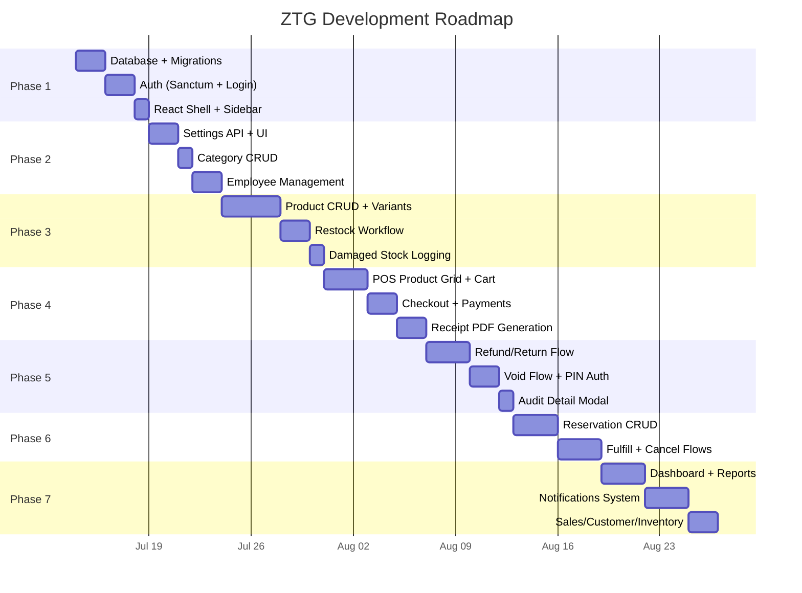

---

## Visual 2: Full System Architecture

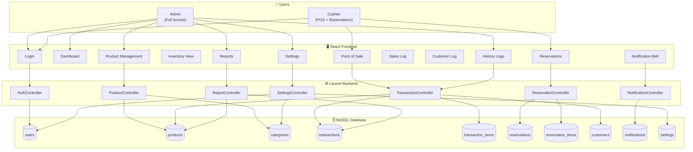

---

## Visual 3: POS Checkout Sequence

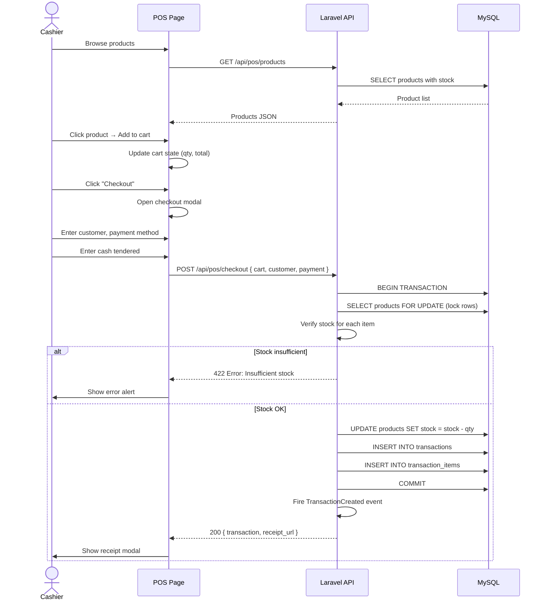

---

## Visual 4: Refund/Void Approval Flow

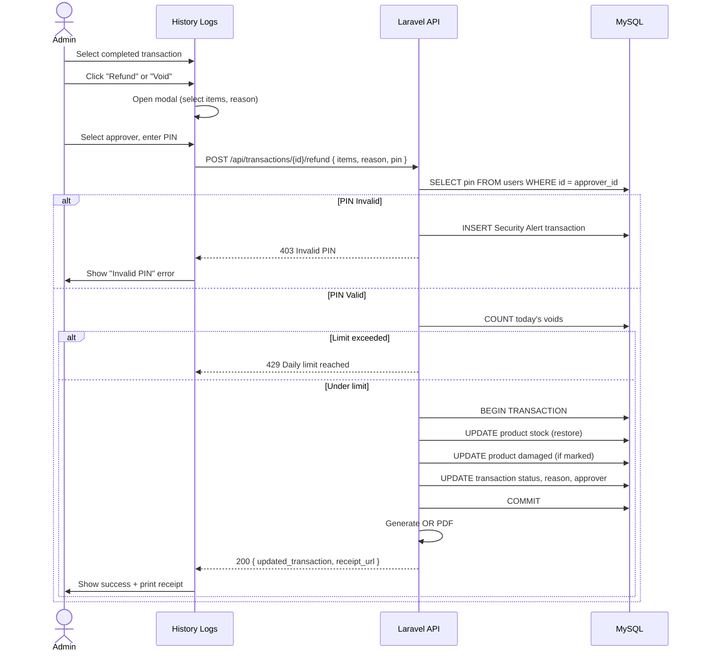

---

## Visual 5: Reservation Lifecycle

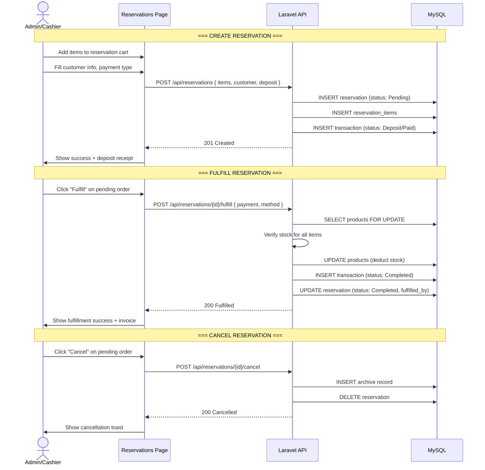

---

## Visual 6: Stock Movement Tracker

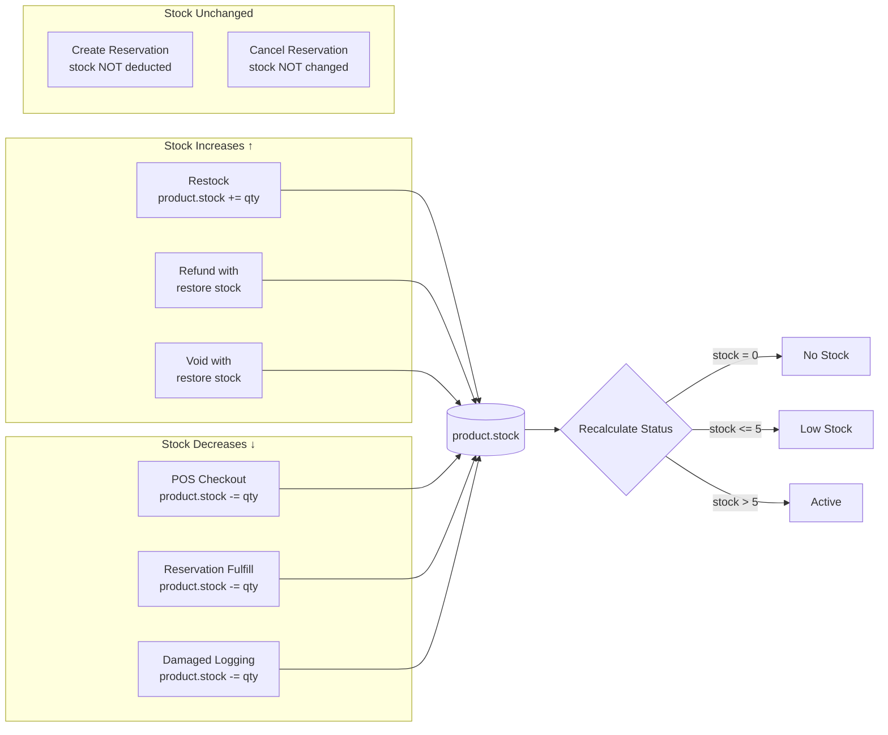

---

## Visual 7: Transaction Types Reference

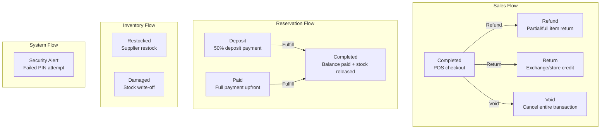

---

## Visual 8: Entity Relationship Overview

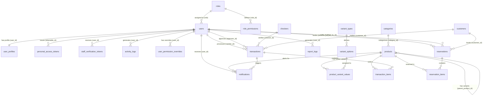

---

## Visual 9: Notification Event Map

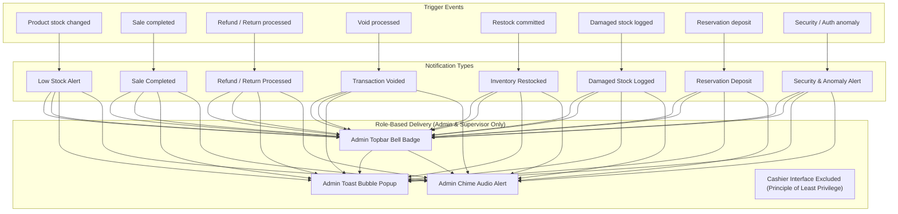

---

## Visual 10: Cross-Module Data Flow

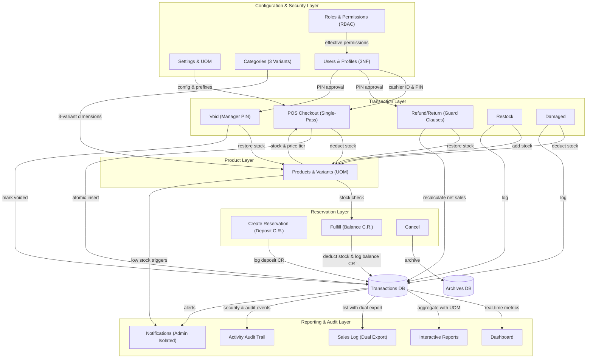

---

## Visual 11: Dynamic 2-Layer RBAC Permission Resolution Flow

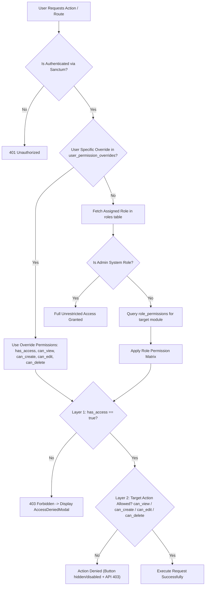

---

## Visual 12: Single-Pass Cart Checkout Sequence

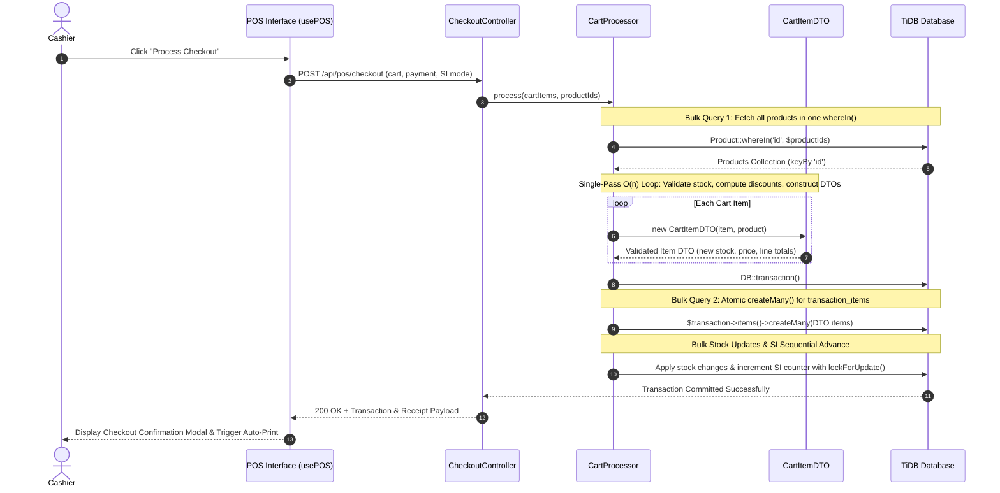

---

## Visual 13: Staff Onboarding & Brevo Verification Flow

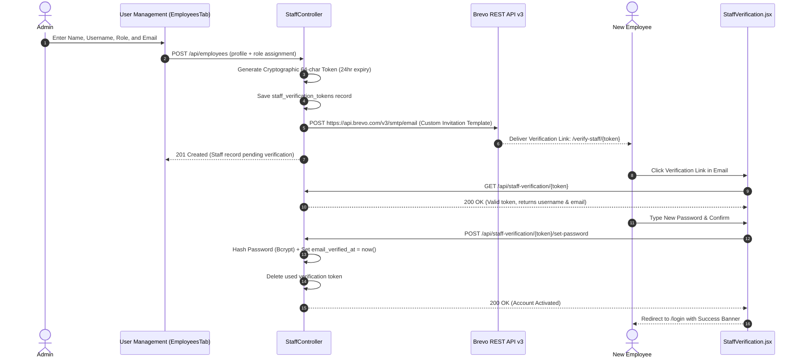
