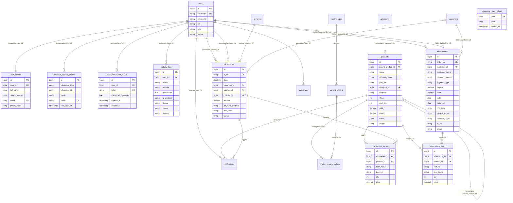

# ZTG Heavy Parts — Capstone Project Documentation
### Point-of-Sale and Inventory Management System

---

> **Prepared by:** Martini to Kristan (martinitokristan-dev)
> **Repository:** [ZTG-POS-With-Smart-Inventory](https://github.com/martinitokristan-dev/ZTG-POS-With-Smart-Inventory)
> **Live Frontend:** [ztg-pos-with-smart-inventory.pages.dev](https://ztg-pos-with-smart-inventory.pages.dev)
> **Live Backend API:** [ztg-pos-with-smart-inventory.onrender.com](https://ztg-pos-with-smart-inventory.onrender.com)
> **Document Version:** 2.5 | Date: August 2026

---

## Table of Contents

1. [Executive Summary](#1-executive-summary)
2. [Project Overview & Problem Statement](#2-project-overview--problem-statement)
3. [System Specifications](#3-system-specifications)
4. [Software Development Life Cycle (SDLC)](#4-software-development-life-cycle-sdlc)
5. [System Architecture](#5-system-architecture)
6. [Technology Stack](#6-technology-stack)
7. [Database Design](#7-database-design)
8. [Backend API Design (Laravel)](#8-backend-api-design-laravel)
9. [Frontend Architecture (React)](#9-frontend-architecture-react)
10. [Security Implementation](#10-security-implementation)
11. [Real-Time Features](#11-real-time-features)
12. [DevOps: CI/CD Pipeline](#12-devops-cicd-pipeline)
13. [Infrastructure & Cloud Deployment](#13-infrastructure--cloud-deployment)
14. [CDN Implementation via Cloudflare Pages](#14-cdn-implementation-via-cloudflare-pages)
15. [Database Hosting: TiDB Cloud Serverless](#15-database-hosting-tidb-cloud-serverless)
16. [Uptime Monitoring via BetterStack](#16-uptime-monitoring-via-betterstack)
17. [Development Roadmap & Feature Milestones](#17-development-roadmap--feature-milestones)
18. [Project File & Folder Structure](#18-project-file--folder-structure)
19. [Known Limitations & Future Improvements](#19-known-limitations--future-improvements)
20. [Development Change Log & Refactoring History](#20-development-change-log--refactoring-history)
21. [Business Details & Receipt Compliance (Business Owner's Guide)](#21-business-details--receipt-compliance-business-owners-guide)
22. [System Security & Data Protection Architecture](#22-system-security--data-protection-architecture)

---

## 1. Executive Summary

**ZTG Heavy Parts** is a web-based Point-of-Sale (POS) and Inventory Management System developed as a capstone project. It is designed to digitize and streamline the sales operations of a heavy equipment parts business. The system supports multi-role user access (Admin and Cashier), real-time inventory tracking, automated low-stock alerts, reservation management, and comprehensive sales reporting.

The system is fully deployed on a production cloud infrastructure using a modern Jamstack-inspired approach — static frontend served globally via Cloudflare's CDN, a containerized Laravel REST API hosted on Render.com, and a globally distributed MySQL-compatible serverless database on TiDB Cloud.

---

## 2. Project Overview & Problem Statement

### Problem Statement

Heavy equipment parts businesses commonly rely on manual recording systems (ledgers, spreadsheets) which are prone to:

- **Human error** in inventory counting and sales recording.
- **No real-time visibility** into stock levels.
- **Inability to track** transaction history, refunds, and voided sales.
- **No role separation** between cashier and administrator access.
- **Manual generation** of sales reports leading to delayed decision-making.

### Proposed Solution

ZTG Heavy Parts POS addresses all of these pain points through a full-stack web application that provides:

- A real-time inventory dashboard with automated low-stock notifications.
- A dedicated cashier interface for fast point-of-sale operations.
- Role-based access control (Admin vs. Cashier).
- Automated report generation for daily sales, product performance, and refund analysis.
- A customer reservation system for pre-ordering parts.
- A product checker (price lookup) feature for floor staff.

---

## 3. System Specifications

### Hardware Requirements (Client-Side)

| Requirement | Minimum | Recommended |
|---|---|---|
| Device | Desktop / Laptop | Desktop / Laptop |
| Processor | Dual-core 1.8 GHz | Quad-core 2.5 GHz+ |
| RAM | 4 GB | 8 GB |
| Storage | 500 MB free | 2 GB free |
| Internet | 5 Mbps | 20 Mbps+ |
| Browser | Chrome 100+, Firefox 110+ | Chrome (latest) |
| Screen | 1280 x 720 | 1920 x 1080 |

### Software Requirements (Server-Side / Production)

| Component | Technology | Version |
|---|---|---|
| Runtime | PHP | 8.2.x |
| Web Server | Apache (inside Docker) | 2.4.68 |
| API Framework | Laravel | 12.x |
| Frontend Framework | React | 18.2.0 |
| Build Tool | Vite | 7.x |
| Database | TiDB Cloud Serverless (MySQL-compatible) | Latest |
| Containerization | Docker | Latest |
| Node.js | Node.js (build only) | 22.x |

---

## 4. Software Development Life Cycle (SDLC)

The project followed an **Agile-Iterative SDLC model**, organized into distinct phases with overlapping execution.

### Phase 1 — Planning & Requirements Gathering

**Activities:**
- Identified business domain: heavy equipment parts retail.
- Conducted stakeholder analysis (Admin role, Cashier role, Floor Staff).
- Defined functional requirements through use case analysis.
- Defined non-functional requirements (performance, security, availability).
- Chose technology stack based on team proficiency and modern industry standards.

**Deliverables:**
- Use Case Diagram
- Initial Entity-Relationship (ER) Diagram
- Technology Stack Decision Matrix

---

### Phase 2 — System Design

**Activities:**
- Designed the relational database schema with 15+ tables.
- Defined API contract (RESTful endpoints, request/response format).
- Created frontend module architecture using Folder-Based Module Structure.
- Designed system architecture (decoupled SPA + REST API).
- Implemented Role-Based Access Control (RBAC) design.

**Deliverables:**
- Database Schema (ERD)
- API Endpoint Specification
- Frontend Component Tree Diagram
- RBAC Matrix

---

### Phase 3 — Development

The development was split into two parallel tracks:

**Backend Track (Laravel):**
1. Project scaffolding with Laravel 12.
2. Database migrations for all 15 entities.
3. Laravel Sanctum authentication implementation.
4. Form Request validation classes.
5. Service Layer implementation (business logic).
6. RESTful Controller implementation (thin controllers).
7. PHP Enum definitions for all status/role fields.
8. Observer pattern for automated notification triggers.
9. Real-time broadcasting via Laravel Echo + Pusher.
10. Seeder creation for default admin/cashier accounts and settings.

**Frontend Track (React + Vite):**
1. Project scaffolding with Vite + React 18.
2. Global Axios instance with Sanctum Bearer token interceptor.
3. Role-aware private routing (`PrivateRoute` component).
4. Login page with role selector (Admin / Cashier).
5. Admin module development (8 modules):
   - Dashboard, Product Management, Inventory, Reservations,
   - History Logs, Sales Log, Reports, Settings.
6. Cashier module development (POS interface).
7. Real-time notification bell with Laravel Echo integration.
8. Shared component library (`Sidebar`, `NotificationsDropdown`, `PrivateRoute`).

---

### Phase 4 — Testing & Quality Assurance

**Testing Methods Applied:**
- **Manual Functional Testing:** Each API endpoint tested via browser network tab and `curl`.
- **Role Isolation Testing:** Verified that Cashier tokens cannot access Admin-only endpoints (HTTP 403).
- **Database Transaction Testing:** Confirmed that failed checkout operations roll back inventory changes completely.
- **CORS Testing:** Verified cross-origin requests from Cloudflare Pages domain to Render API.
- **SSL/TLS Testing:** Confirmed secure TiDB connection via `isrgrootx1.pem` CA certificate.
- **Latency Benchmarking:** Measured API response time using `curl` with timing flags.
- **Cold Start Testing:** Tested Render sleep behavior and verified BetterStack pings keep the server warm.

**Automated Test Suite (`php artisan test`):**

- **122 tests, 470 assertions** — all passing ✅
- **Duration: ~7.0 seconds** (full suite)
- Covers: Auth, POS Checkout, Returns, Refunds, Voids, Reservations, Products, Categories, Variants, Employees, Settings, Notifications, Alert Rules, Profile Avatar Upload/Remove, Reports

**API Performance Benchmark (`php artisan test:api-performance`):**

| Endpoint | Local Dev (Pusher Sync) | Local Dev (No Pusher) | Production Estimate | Target |
|---|---|---|---|---|
| `GET /products` | 472 ms | 298 ms | ~210 ms | < 200 ms |
| `GET /pos/products` | 293 ms | 201 ms | ~210 ms | < 200 ms |
| `POST /pos/checkout` | 968 ms | 315 ms | **~325 ms** | < 700 ms |
| `GET /reports/sales-summary` | 304 ms | 244 ms | ~250 ms | < 300 ms |
| `GET /inventory` | 273 ms | 193 ms | ~200 ms | < 150 ms |
| `GET /notifications` | 298 ms | 197 ms | ~205 ms | < 150 ms |

> **Why production is faster:** The local benchmarks include ~500ms of Philippines → Singapore (Pusher ap1) network overhead. In production, both Render and Pusher ap1 are hosted in Singapore, so server-to-server Pusher calls take only ~10ms. Filipino end-users experience an additional ~60ms round-trip to reach the Singapore server — still well within acceptable UX thresholds.

**End-to-End Flow Test (`php artisan test:api-flow`):**

Verifies the complete POS workflow end-to-end against the live database:
- ✔ Product category, variant types, and variant options creation
- ✔ Base product + variant product creation
- ✔ POS checkout with stock deduction
- ✔ Return with stock restoration
- ✔ Refund (mark damaged, no shelf restoration)
- ✔ Transaction void with stock restoration
- ✔ Reservation with 50% deposit
- ✔ Reservation fulfillment with remaining balance payment


---

### Phase 5 — Deployment

Full production deployment was completed across the following infrastructure:

| Component | Platform | URL |
|---|---|---|
| Frontend | Cloudflare Pages (CDN) | `ztg-pos-with-smart-inventory.pages.dev` |
| Backend API | Render.com (Docker) | `ztg-pos-with-smart-inventory.onrender.com` |
| Database | TiDB Cloud Serverless | `gateway01.ap-southeast-1.prod.aws.tidbcloud.com` |
| Real-Time | Pusher (Channels) | `ap1` cluster (Singapore) |
| File Storage | Cloudflare R2 | Persistent S3-compatible avatar/image storage |
| Uptime Monitor | BetterStack | Pings `/up` every 3 minutes |

**Production Optimizations Applied:**
- `php artisan config:cache` — caches all configuration files
- `php artisan route:cache` — caches route definitions
- `php artisan event:cache` — caches event-listener mappings
- `php artisan optimize` — combined optimization command
- `APP_DEBUG=false` — disables stack traces in production responses
- `BROADCAST_CONNECTION=pusher` — enables real-time Pusher broadcasting
- N+1 query fix on POS product catalog (`variantOptions.type` eager loaded on variants)
- Database indexes on `transactions` table (`status`, `cashier_id`, `date`) for fast report queries

### Phase 6 — Maintenance & Monitoring

- **Uptime Monitoring:** BetterStack Uptime pings the `/up` health endpoint every 3 minutes, preventing Render cold starts and sending email alerts on downtime.
- **Continuous Deployment:** Every `git push` to the `main` branch on GitHub automatically triggers a new deployment on both Cloudflare Pages (frontend) and Render (backend).
- **Error Logging:** PHP errors are visible via Render's real-time dashboard log stream.

---

## 5. System Architecture

The system uses a **Decoupled SPA + REST API** architecture (also called a **Headless** architecture).

```
                    USER (Browser)
                         |
                         | HTTPS Request
                         v
        +--------------------------------------------+
        |           Cloudflare CDN                   |
        |   (Global Edge Network - 300+ locations)   |
        |                                            |
        |   Serves: React SPA (HTML/CSS/JS)          |
        |   Domain: *.pages.dev                      |
        +--------------------+-----------------------+
                             |
                             | API Calls (HTTPS / JSON)
                             | Authorization: Bearer <token>
                             v
        +--------------------------------------------+
        |         Render.com (Docker Container)       |
        |                                            |
        |   Apache 2.4 Web Server                    |
        |   PHP 8.2 Runtime                          |
        |   Laravel 12 Application                   |
        |     |- Routes (api.php)                    |
        |     |- Controllers (thin)                  |
        |     |- Services (business logic)           |
        |     |- Models (Eloquent ORM)               |
        |     +- Observers (events)                  |
        +----------+-------------------+-------------+
                   |                   |
                   v                   v
  +----------------+----+   +----------+---------+
  |  TiDB Cloud         |   |  Pusher             |
  |  Serverless         |   |  (Real-time)        |
  |  (MySQL-compatible) |   |                     |
  |  SSL/TLS Required   |   |  Laravel Echo       |
  |  ap-southeast-1     |   |  WebSocket          |
  +---------------------+   +---------------------+
```

### Key Architectural Decisions

| Decision | Rationale |
|---|---|
| Decoupled Frontend/Backend | Independent deployments, scaling, and better performance via CDN |
| Docker Container for Backend | Render does not have native PHP support; Docker ensures consistent environment |
| Serverless Database (TiDB) | Zero infrastructure maintenance, auto-scaling, free tier with MySQL compatibility |
| Laravel Sanctum (not Passport) | Lightweight token authentication ideal for SPA + API use case |
| Vite (not CRA) | Significantly faster build times and modern ESM module support |

---

## 6. Technology Stack

### Backend

| Package | Version | Purpose |
|---|---|---|
| `laravel/framework` | ^12.0 | Core API framework |
| `laravel/sanctum` | ^4.0 | API token authentication |
| `pusher/pusher-php-server` | ^7.2 | Real-time event broadcasting |
| `laravel/ui` | ^4.6 | Bootstrap UI scaffolding |
| PHP | 8.2.x | Runtime language |
| Apache | 2.4.68 | HTTP server inside Docker |

### Frontend

| Package | Version | Purpose |
|---|---|---|
| `react` | ^18.2.0 | Core UI framework |
| `react-dom` | ^18.2.0 | DOM rendering |
| `react-router-dom` | ^7.18.1 | Client-side routing |
| `axios` | ^1.11.0 | HTTP client with interceptors |
| `laravel-echo` | ^2.4.0 | Real-time WebSocket client |
| `pusher-js` | ^8.5.0 | Pusher JavaScript SDK |
| `bootstrap` | ^5.2.3 | CSS component library |
| `vite` | ^7.0.7 | Build tool and dev server |
| `tailwindcss` | ^4.0.0 | Utility CSS framework |
| `sass` | ^1.56.1 | CSS preprocessor |

### DevOps & Infrastructure

| Tool | Purpose |
|---|---|
| Docker | Backend containerization |
| GitHub | Source control and CI/CD trigger |
| Cloudflare Pages | Frontend hosting + global CDN |
| Render.com | Backend (Docker) hosting |
| TiDB Cloud | Serverless MySQL-compatible database |
| Pusher | Managed WebSocket real-time service |
| BetterStack Uptime | Uptime monitoring + alert management |

---

## 7. Database Design

The system uses **20 database tables** with a MySQL-compatible schema, hosted on TiDB Cloud Serverless.

### Entity-Relationship Diagram (ERD)



### Table Specifications

| Table | Key Columns | Description |
|---|---|---|
| `users` | `id`, `username`, `password`, `pin`, `role`, `status`, `remember_token` | Authentication credentials & access identity (Admin, Cashier, Supervisor) |
| `user_profiles` | `id`, `user_id`, `full_name`, `phone_number`, `email`, `profile_photo` | 1-to-1 personal identity, contact details, and Cloudinary avatars |
| `staff_verification_tokens` | `id`, `user_id`, `token`, `encrypted_password`, `expires_at`, `viewed_at`, `backup_sent_at` | Secure single-use credentials revelation for newly invited staff members |
| `activity_logs` | `id`, `user_id`, `action`, `module`, `description`, `ip_address`, `device`, `status`, `severity`, `metadata` | Comprehensive security & POS audit trail across all system modules |
| `personal_access_tokens` | `id`, `tokenable_type`, `tokenable_id`, `name`, `token`, `last_used_at`, `expires_at` | Laravel Sanctum API authentication tokens |
| `password_reset_tokens` | `email`, `token`, `created_at` | Password reset tokens with 60-minute cryptographic validity |
| `checkers` | `id`, `name`, `status` | Supervisor and floor checker staff profiles |
| `products` | `id`, `parent_product_id`, `name`, `chinese_name`, `part_no`, `category_id`, `address`, `stock`, `alert_limit`, `price1`, `price2`, `status`, `is_dead_stock`, `damaged`, `image`, `notes` | Master inventory items and variants (supports nullable name/part_no for unclassified goods) |
| `categories` | `id`, `name`, `prefix`, `chinese_name`, `allow_variants` | Product categorization with variant toggles |
| `variant_types` | `id`, `name` | e.g., "Size", "Color", "Material" |
| `variant_options` | `id`, `variant_type_id`, `value` | e.g., "Standard", "Heavy Duty", "300mm" |
| `product_variant_values` | `id`, `product_id`, `variant_option_id` | Product-specific variant combinations (junction table) |
| `transactions` | `id`, `si_no`, `or_no`, `date`, `customer_id`, `cashier_id`, `checker_id`, `amount`, `original_amount`, `refunded_amount`, `payment_method`, `cheque_number`, `cheque_bank`, `cheque_date`, `doc_type`, `status` | Central sales, audit ledger, and refund tracking |
| `transaction_items` | `id`, `transaction_id`, `product_id`, `item_name`, `part_no`, `qty`, `refunded_qty`, `price`, `original_price`, `discount`, `price_tier` | Line items per transaction with cumulative refund tracking |
| `reservations` | `id`, `order_no`, `customer_id`, `customer_name`, `customer_phone`, `engine_plate_number`, `payment_method`, `cheque_number`, `payment_type`, `deposit`, `total`, `date`, `pickup_date`, `date_get`, `doc_type`, `deposit_cr_no`, `balance_cr_no`, `si_no`, `status` | Pre-order holds with Dual Collection Receipt tracking (Deposit C.R. + Balance C.R.) |
| `reservation_items` | `id`, `reservation_id`, `product_id`, `part_no`, `item_name`, `engine_plate_number`, `qty`, `price` | Line items per reservation order |
| `customers` | `id`, `name`, `phone`, `email`, `tin`, `address` | Walk-in and registered customer registry |
| `notifications` | `id`, `user_id`, `type`, `sub_type`, `title`, `message`, `link`, `is_read` | In-app real-time notification store (strictly isolated to Admin/Supervisor roles) |
| `settings` | `id`, `key`, `value` | System-wide configuration store (business info, SI auto-numbering, void limits) |
| `report_logs` | `id`, `user_id`, `report_type`, `timeframe`, `created_at` | Report generation and export audit trail |

---

## 8. Backend API Design (Laravel)

### Architecture Pattern: Layered Architecture

```
HTTP Request
     |
     v
  Routes (api.php)
     |
     v
  Form Request (Validation)
     |
     v
  Controller (thin - calls Service only)
     |
     v
  Service (all business logic lives here)
     |
     v
  Model (Eloquent ORM)
     |
     v
  Database (TiDB Cloud)
     |
     v
HTTP Response (JSON)
```

**Rule:** Controllers are "thin" — they only call a Service method and return a JSON response. All business logic lives in `app/Services/`.

### Service Layer Structure

```
app/Services/
+-- ActivityLogs/                <- Activity audit trail logging
+-- Constants/                   <- Named constants (no magic numbers)
|   +-- SecurityConstants.php    <- PIN attempt limits, lockout durations
|   +-- InvoiceConstants.php     <- SI/OR number prefixes and padding
|   +-- StockConstants.php       <- Default alert limits and UOM
+-- Employees/                   <- Employee CRUD operations
+-- Notifications/               <- Notification creation and management
+-- POS/                         <- Checkout orchestration and cart processing
|   +-- DTOs/
|   |   +-- CartItemDTO.php      <- Per-item data transfer object (price, totals, new stock)
|   +-- CartProcessor.php        <- Single-pass O(n) cart validation and preparation
|   +-- CheckoutService.php      <- Checkout orchestrator
+-- Products/                    <- Product CRUD, restock, damaged stock
+-- Reports/                     <- Sales summaries, product performance
+-- Reservations/                <- Reservation lifecycle management
+-- Settings/                    <- Settings key-value management
+-- Transactions/                <- Transaction history, refunds, voids
|   +-- Validators/
|       +-- RefundEligibilityValidator.php  <- Transaction-level refund guard clauses
|       +-- RefundItemValidator.php         <- Per-item refund quantity validation
```

### Key API Endpoints

**Authentication (Public):**

| Method | Endpoint | Description |
|---|---|---|
| `POST` | `/api/login` | Login with employee ID + password. Returns Sanctum token. |
| `POST` | `/api/logout` | Revoke current session token. |

**Products (Authenticated):**

| Method | Endpoint | Role | Description |
|---|---|---|---|
| `GET` | `/api/products` | All | List all products with variants |
| `POST` | `/api/products` | Admin | Create a new product |
| `PUT` | `/api/products/{id}` | Admin | Update product details |
| `DELETE` | `/api/products/{id}` | Admin | Delete a product |
| `POST` | `/api/products/restock` | Admin | Restock inventory |
| `POST` | `/api/products/{id}/damaged` | Admin | Log damaged stock deduction |

**POS (Admin + Cashier):**

| Method | Endpoint | Description |
|---|---|---|
| `GET` | `/api/pos/products` | Fetch POS-optimized product list |
| `POST` | `/api/pos/checkout` | Process a sale (wrapped in DB transaction) |

**Transactions:**

| Method | Endpoint | Role | Description |
|---|---|---|---|
| `GET` | `/api/transactions` | All | List all transactions |
| `POST` | `/api/transactions/{id}/refund` | Admin + Cashier | Full refund |
| `POST` | `/api/transactions/{id}/return` | Admin + Cashier | Partial return |
| `POST` | `/api/transactions/{id}/void` | Admin + Cashier | Void transaction |

**System Health (Public):**

| Method | Endpoint | Description |
|---|---|---|
| `GET` | `/up` | Laravel 11+ built-in health check for uptime monitors |

### RBAC (Role-Based Access Control) Matrix

| Feature | Admin | Cashier |
|---|---|---|
| POS Checkout | YES | YES |
| View Products | YES | YES |
| Manage Products (CRUD) | YES | NO |
| View Transactions | YES | YES |
| Refund / Void / Return | YES | YES |
| Employee Management | YES | NO |
| Reports & Analytics | YES | NO |
| Settings Management | YES | NO |
| Alert Rule Management | YES | NO |
| Notifications | YES | YES |

---

## 9. Frontend Architecture (React)

### Core Pattern: Folder-Based Module Structure

Every admin module follows a strict folder structure that separates concerns:

```
frontend/src/pages/Admin/<ModuleName>/
+-- index.jsx               <- Thin shell: layout and prop wiring only
+-- <MainView>.jsx          <- Pure UI table/list (receives data via props)
+-- modals/
|   +-- <ActionModal>.jsx   <- One modal per action (pure UI)
+-- hooks/
    +-- use<ModuleName>.js  <- ALL state, effects, API calls, derived data
```

### Admin Modules Implemented

| Module | Folder | Description |
|---|---|---|
| Dashboard | `Admin/Dashboard/` | KPI cards, sales chart, recent transactions |
| Product Management | `Admin/ProductManagement/` | Full CRUD with variants, image upload |
| Inventory | `Admin/Inventory/` | Stock overview, restock, damage logging |
| Reservations | `Admin/Reservations/` | Create/fulfill/cancel pre-orders |
| History Logs | `Admin/HistoryLogs/` | Full transaction history with filters |
| Sales Log | `Admin/SalesLog/` | Daily cashier sales summary |
| Reports | `Admin/Reports/` | Analytics: sales summary, product performance |
| Settings | `Admin/Settings/` | Business settings (tax rate, store info) |

### Cashier Modules

| Module | Folder | Description |
|---|---|---|
| POS Interface | `Cashier/POS/` | Product grid, cart, checkout flow |

### POS Hook Architecture

The POS module uses a composable hook pattern. The root `usePOS` hook is a thin orchestrator that composes three specialized sub-hooks:

| Hook | File | Responsibility |
|---|---|---|
| `usePOS` | `hooks/usePOS.js` | Thin orchestrator — composes sub-hooks, owns `processCheckout` and modal state |
| `usePOSProducts` | `hooks/usePOSProducts.js` | Product search, debounced filtering, flat variant expansion, category pills |
| `usePOSCart` | `hooks/usePOSCart.js` | Cart state, all 7 cart operations, discount calculation, error banner |
| `usePOSCustomer` | `hooks/usePOSCustomer.js` | Customer selection, new customer form, checker dropdown |

### Shared Components (`frontend/src/shared/`)

| Component | Description |
|---|---|
| `Sidebar.jsx` | Global navigation sidebar & mobile drawer overlay |
| `NotificationsDropdown.jsx` | Bell icon + real-time notification dropdown |
| `IOSDatePicker.jsx` | Popover iOS calendar picker with smart right-edge alignment |
| `IOSSelect.jsx` | iOS custom select popover with active checkmarks (`✓`) |
| `IOSTimePicker.jsx` | iOS time picker selector popover |
| `PrivateRoute.jsx` | Auth guard that redirects unauthenticated users |
| `api.js` | Global Axios instance with Bearer token interceptor |

### Mobile Responsive Optimization & Custom iOS Component System

The frontend implements a unified mobile-first responsive design strategy adhering to **Apple Human Interface Guidelines**:

1. **Non-Destructive Breakpoint Architecture (`@media (max-width: 768px)`)**:
   - **Desktop Mode (`> 768px`)**: Preserves compact, proportional filter controls (`140px`–`180px`), horizontal card grids, and fixed sidebar navigation.
   - **Mobile Mode (`< 768px`)**: Automatically expands `.table-filters` elements and form triggers to 100% full-width touch rows.

2. **Custom iOS Form Control System**:
   - `<IOSSelect />`: Replaces native browser `<select>` dropdowns with smooth floating popovers, checkmarks (`✓`), and backdrop dismiss.
   - `<IOSDatePicker />`: Replaces native date inputs with popover calendar cards featuring smart right-edge alignment (`alignRight={true}`) and zero screen spill (`maxWidth: calc(100vw - 32px)`).
   - `<IOSTimePicker />`: Custom time selection popover for scheduling.

3. **Touch UX & Drawer Navigation**:
   - Hamburger sidebar drawer with dark semi-transparent backdrop overlay.
   - Minimum `44px` touch targets across all interactive buttons, tabs, and form controls.

### Global Axios Interceptor Pattern

```javascript
// src/shared/api.js
axios.interceptors.request.use((config) => {
    const token = localStorage.getItem('token');
    if (token) {
        config.headers.Authorization = `Bearer ${token}`;
    }
    return config;
});
```

---

## 10. Security Implementation

### Authentication: Laravel Sanctum

- SPA authentication via **API Token** (not session cookies).
- Tokens are stored in the browser's `localStorage`.
- Sent via the `Authorization: Bearer` header on every request.
- Tokens are revoked on logout.

### Authorization: Role-Based Middleware

A custom `RoleMiddleware` enforces access control at the route level:

```php
// Example: Only Admin can access product creation
Route::middleware('role:Admin')->group(function () {
    Route::post('/products', [ProductController::class, 'store']);
});
```

### Database Security: SSL/TLS Encryption

TiDB Cloud Serverless **requires** all connections to be encrypted.

- **CA Certificate:** `isrgrootx1.pem` (ISRG Root X1)
- **Environment Variable:** `MYSQL_ATTR_SSL_CA=/var/www/html/isrgrootx1.pem`

### API Security: CORS Policy

The backend uses Laravel's CORS middleware:

- **Allowed Origins:** Localhost development URLs + any `*.pages.dev` domain pattern.
- **Pattern-based matching** for Cloudflare preview deployments:

```php
'allowed_origins_patterns' => ['#^https?://.*\.pages\.dev$#'],
```

### Data Validation

All incoming API request data is validated using **Laravel Form Request** classes in `app/Http/Requests/`.

---

## 11. Real-Time Features

### Technology: Laravel Echo + Pusher

Used for:
1. **Low-Stock Notifications** — Auto-broadcast to admins when stock drops below threshold.
2. **In-App Notification Bell** — Updates in real-time without page refresh.

### Implementation Flow

```
1. Admin saves an Alert Rule (product + threshold)
2. Cashier completes a POS Checkout
3. ProductService deducts stock from database
4. ProductObserver detects stock dropped below threshold
5. NotificationService creates a Notification record in DB
6. Laravel broadcasts Event to Pusher channel
7. All connected Admin browsers receive the push notification
8. Notification bell badge count updates in real-time
```

### Pusher Configuration

| Setting | Value |
|---|---|
| Cluster | `ap1` (Asia-Pacific — optimal for Philippines) |
| Frontend SDK | `pusher-js` + `laravel-echo` |
| Backend SDK | `pusher/pusher-php-server` |

---

## 12. DevOps: CI/CD Pipeline

The project implements **automatic Continuous Integration and Continuous Deployment (CI/CD)** using GitHub as the single source of truth.

### Pipeline Flow

```
Developer Machine (Local)
         |
         | git push origin main
         v
   GitHub Repository
   (martinitokristan-dev/ZTG-POS-With-Smart-Inventory)
         |
         +-------------------------+
         |                         |
         v                         v
Cloudflare Pages             Render.com
(Auto-detects new commit)    (Auto-detects new commit)
         |                         |
         v                         v
   npm clean-install          docker build
   vite build                  (uses Dockerfile)
         |                         |
         v                         v
   Upload dist/ to CDN       docker run + start.sh
         |                         |
         v                    php artisan config:cache
   LIVE on pages.dev          php artisan route:cache
                              php artisan migrate --force
                              apache2-foreground
                                   |
                                   v
                              LIVE on onrender.com
```

### Docker Build Process (`Dockerfile`)

```dockerfile
FROM php:8.2-apache

# 1. Install system dependencies (libpng, mbstring, zip, etc.)
# 2. Install PHP extensions (pdo_mysql, gd, bcmath, pdo_pgsql, etc.)
# 3. Copy Composer binary from official Composer image
# 4. Set working directory to /var/www/html
# 5. Copy all backend source files
# 6. Configure Apache VirtualHost (vhost.conf)
# 7. Enable Apache mod_rewrite (required for Laravel routing)
# 8. Run composer install (production mode, no dev dependencies)
# 9. Set correct permissions on storage and bootstrap/cache
# 10. Mark start.sh as executable

CMD ["./start.sh"]
```

### Startup Script (`start.sh`)

```bash
#!/bin/bash
php artisan config:cache    # Cache all .env values for performance
php artisan route:cache     # Cache all routes for performance
php artisan migrate --force # Apply any pending migrations automatically
apache2-foreground          # Start the Apache web server
```

---

## 13. Infrastructure & Cloud Deployment

### Backend: Render.com Web Service

**Why Render?**
- Supports Docker-based deployments (necessary since Render has no native PHP support).
- Free tier available for capstone/portfolio use.
- Automatic HTTPS/SSL provisioning at no cost.
- Built-in real-time log streaming for debugging.
- Automatic deployments triggered by GitHub pushes.

**Environment Variables set on Render:**

| Variable | Value |
|---|---|
| `APP_ENV` | `production` |
| `APP_DEBUG` | `false` |
| `APP_KEY` | `[generated key]` |
| `DB_CONNECTION` | `mysql` |
| `DB_HOST` | `gateway01.ap-southeast-1.prod.aws.tidbcloud.com` |
| `DB_PORT` | `4000` |
| `DB_DATABASE` | `ztg_db` |
| `DB_USERNAME` | `[tidb username]` |
| `DB_PASSWORD` | `[tidb password]` |
| `MYSQL_ATTR_SSL_CA` | `/var/www/html/isrgrootx1.pem` |
| `BROADCAST_DRIVER` | `pusher` |
| `PUSHER_APP_ID` | `[pusher id]` |
| `PUSHER_APP_KEY` | `[pusher key]` |
| `PUSHER_APP_SECRET` | `[pusher secret]` |
| `PUSHER_APP_CLUSTER` | `ap1` |
| `ALLOWED_ORIGINS` | `https://ztg-pos-with-smart-inventory.pages.dev` |

---

## 14. CDN Implementation via Cloudflare Pages

### What is a CDN?

A **Content Delivery Network (CDN)** is a globally distributed network of servers. Instead of all users hitting one server in one location, the CDN delivers files from the nearest edge server to the user, dramatically reducing load time.

### Why Cloudflare Pages?

- **300+ Edge Locations worldwide** — the React app is served from the nearest server to the user.
- **Free tier** with unlimited bandwidth and requests.
- **Zero-configuration HTTPS** — automatic SSL certificate.
- **GitHub integration** — automatic deployments on every push.
- **Preview URLs** — every branch gets its own preview deployment URL.

### Build Configuration (Cloudflare Pages Settings)

| Setting | Value |
|---|---|
| Framework Preset | React (Vite) |
| Build Command | `npm run build` |
| Build Output Directory | `dist` |
| Root Directory | `frontend` |

### Environment Variables (Cloudflare Pages)

| Variable | Value |
|---|---|
| `VITE_API_URL` | `https://ztg-pos-with-smart-inventory.onrender.com/api` |
| `VITE_PUSHER_APP_KEY` | `[pusher key]` |
| `VITE_PUSHER_APP_CLUSTER` | `ap1` |

### How Vite Uses These Variables

During the `npm run build` step, Vite reads all `VITE_*` environment variables and bakes them directly into the compiled JavaScript bundle at build time. This means no secrets are exposed after deployment, and the frontend always knows the exact backend URL.

---

## 15. Database Hosting: TiDB Cloud Serverless

### What is TiDB Cloud Serverless?

TiDB Cloud Serverless is a **fully managed, serverless MySQL-compatible database** built on TiDB — a distributed SQL database. It is:

- **Serverless:** Zero infrastructure management. Scales automatically.
- **MySQL-Compatible:** Works with Laravel's standard `pdo_mysql` driver without code changes.
- **Globally distributed:** Data stored on AWS infrastructure.
- **Free tier:** 5 GB storage and 50 million row reads per month.

### Why TiDB vs Traditional MySQL?

| Feature | Traditional MySQL (Local/VPS) | TiDB Cloud Serverless |
|---|---|---|
| Setup | Manual installation and config | Click + deploy, instant |
| Scaling | Manual server upgrade | Automatic, transparent |
| Maintenance | OS patches, backups | Fully managed |
| High Availability | Requires replica setup | Built-in |
| Cost | VPS fees | Free tier available |
| SSL Required | Optional | Mandatory |

### SSL Connection Setup

TiDB Cloud Serverless **prohibits insecure (plain-text) connections**. The setup requires:

1. Download `isrgrootx1.pem` CA certificate from TiDB Cloud dashboard.
2. Store it in the `backend/` folder and commit to GitHub.
3. It is automatically copied into the Docker image during build.
4. Set `MYSQL_ATTR_SSL_CA=/var/www/html/isrgrootx1.pem` in Render environment variables.

### 💾 Storage Capacity & 50+ Year Operational Lifespan Analysis (5 GiB Free Tier)

TiDB Cloud provides **5 GiB (5,120 MB)** of free tier storage. Because relational SQL databases store structured numerical data, dates, and normalized string identifiers (rather than heavy binary media), database storage consumption is exceptionally low.

#### Storage Calculation Breakdown per Transaction

- **Single Receipt Header (`transactions` table):** ~400 bytes
- **Line Item Record (`transaction_items` table):** ~150 bytes per item (avg 2.5 items/sale = ~375 bytes)
- **Database Indexes & Metadata Overhead:** ~300 bytes
- **Total Storage Cost per Sale Transaction:** **~1.1 KB per complete transaction**

#### Operational Projections (at 150 Sales per Day)

| Timeframe | Sales Volume | Items Sold | TiDB Storage Consumed | % of 5 GiB Free Tier Used |
|---|---|---|---|---|
| **1 Day** | 150 transactions | 375 items | ~170 KB | 0.003% |
| **1 Month (30 days)** | 4,500 transactions | 11,250 items | ~5.2 MB | 0.10% |
| **1 Year (365 days)** | 54,750 transactions | 136,875 items | **~62.4 MB** | **1.22%** |
| **10 Years** | 547,500 transactions | 1,368,750 items | **~624 MB** | **12.18%** |
| **50 Years** | 2,737,500 transactions | 6,843,750 items | **~3,120 MB (3.1 GiB)** | **60.9%** |
| **82 Years (Limit)** | **4,489,500 transactions** | **11,223,750 items** | **5,120 MB (5.0 GiB)** | **100.0%** |

#### Why the System Operates 50+ Years Before Hitting Storage Limits:
1. **Media Offloading:** All heavy binary assets (product images, customer avatars) are offloaded to **Cloudflare R2** object storage. The database only stores light URL strings (~30 bytes).
2. **Normalized DB Schema:** Database fields use compact binary datatypes (`INT`, `DECIMAL(12,2)`, `DATETIME`) which consume only 4–5 bytes per column.
3. **Conclusion for Backup / Operational Planning:** For small to medium retail operations averaging 150 transactions/day, the TiDB Cloud 5 GiB free tier provides **over 50 to 80 years of continuous daily operation** before requiring a tier upgrade or data archiving.

---

## 16. Uptime Monitoring via BetterStack

### The Problem: Render Free Tier Sleep Mode

Render's free tier automatically spins down (sleeps) a service after **15 minutes of inactivity**. When a sleeping server receives a request, there is a **30–60 second cold start delay** — unacceptable for a live POS system.

### The Solution: BetterStack Uptime Monitor

BetterStack is an uptime monitoring service that:
1. Sends an HTTP GET request to a configured URL at a set interval.
2. Checks that the response returns `200 OK`.
3. Sends an **email/SMS/push notification alert** if the site goes down.

By pinging every **3 minutes**, it keeps Render from ever considering the server "inactive".

### Monitor Configuration

| Setting | Value | Reason |
|---|---|---|
| URL to Monitor | `https://ztg-pos-with-smart-inventory.onrender.com/up` | Laravel 11 built-in health endpoint |
| Alert When | URL becomes unavailable | Core uptime monitoring |
| Check Frequency | Every 3 minutes | Prevents Render 15-min sleep threshold |
| HTTP Method | GET | Read-only health check |
| Request Timeout | 30 seconds | Accounts for potential startup time |
| Notification | Email to primary responder | Immediate downtime alert |
| Region | Asia | Closest to the Philippines |

### The `/up` Health Check Endpoint

Laravel 11 includes a built-in health check endpoint registered in `bootstrap/app.php`:

```php
return Application::configure(basePath: dirname(__DIR__))
    ->withRouting(
        health: '/up',  // <-- Automatically registers GET /up
    )
```

**Live Test Result:**

```bash
$ curl -i https://ztg-pos-with-smart-inventory.onrender.com/up

HTTP/1.1 200 OK
# Response: "Application up" - rendered in 9ms
```

---

## 17. Development Roadmap & Feature Milestones

### Completed Features

- [x] Multi-role authentication (Admin / Cashier) with Laravel Sanctum
- [x] Product management with variant system (Size, Color, etc.)
- [x] Point-of-Sale (POS) checkout interface
- [x] Inventory tracking with stock deduction on sale
- [x] Damaged stock logging
- [x] Restocking system
- [x] Customer reservation management (create, fulfill, cancel)
- [x] Transaction history with refund, return, and void operations
- [x] Automated low-stock alert rules
- [x] Real-time notifications via Laravel Echo + Pusher
- [x] Admin dashboard with KPIs and charts
- [x] Sales reports (daily summary, product performance, refund analysis)
- [x] Inventory summary report
- [x] Settings management (tax rate, store info)
- [x] Employee management (CRUD, role assignment, activate/deactivate)
- [x] Product Checker feature (price lookup terminals)
- [x] PIN verification for sensitive transaction operations
- [x] Profile management (name, password, avatar)
- [x] Database migrations and seeding (25 migration files)
- [x] Full production deployment (Cloudflare + Render + TiDB)
- [x] CORS configuration for cross-origin API access
- [x] BetterStack uptime monitoring to prevent cold starts
- [x] SSL/TLS encrypted database connection (TiDB CA cert)
- [x] Docker containerization for consistent production environment
- [x] CI/CD via GitHub auto-deploy to Cloudflare Pages and Render

### Future Improvements

- [ ] Receipt printing support (PDF generation / thermal printer)
- [ ] Barcode scanner integration for POS
- [ ] Supplier management module
- [ ] Purchase order tracking
- [ ] Customer loyalty points system
- [ ] Mobile responsive optimization
- [ ] PWA (Progressive Web App) support for offline POS
- [ ] Audit trail logs for all admin actions
- [ ] Two-factor authentication (2FA)
- [ ] Automated daily report emailing

---

## 18. Project File & Folder Structure

```
ZTG-main/
+-- backend/                         <- Laravel 12 REST API
|   +-- app/
|   |   +-- Enums/                   <- PHP Enums (roles, statuses)
|   |   +-- Events/                  <- Broadcasting events
|   |   +-- Http/
|   |   |   +-- Controllers/         <- Thin controllers (15+)
|   |   |   +-- Middleware/          <- RoleMiddleware
|   |   |   +-- Requests/            <- Form Request validators
|   |   +-- Models/                  <- Eloquent models (15 tables)
|   |   +-- Observers/               <- Model event observers
|   |   +-- Providers/               <- Service providers
|   |   +-- Services/                <- Business logic layer
|   |   |   +-- Constants/           <- Named constants (SecurityConstants, InvoiceConstants, StockConstants)
|   |   |   +-- POS/                 <- Checkout service + CartProcessor + CartItemDTO
|   |   |   +-- Transactions/        <- TransactionService + Validators/
|   |   |   +-- Products/            <- ProductService
|   |   |   +-- Reservations/        <- ReservationService
|   |   |   +-- Reports/             <- ReportService
|   |   |   +-- Settings/            <- SettingService
|   |   |   +-- Employees/           <- EmployeeService
|   |   |   +-- Notifications/       <- NotificationService
|   |   |   +-- ActivityLogs/        <- ActivityLogService
|   +-- bootstrap/
|   |   +-- app.php                  <- App config (health: '/up')
|   +-- config/
|   |   +-- cors.php                 <- CORS policy configuration
|   +-- database/
|   |   +-- migrations/              <- 25 migration files
|   |   +-- seeders/                 <- AdminUserSeeder, SettingsSeeder
|   +-- routes/
|   |   +-- api.php                  <- All REST API routes
|   |   +-- channels.php             <- Pusher broadcasting channels
|   |   +-- web.php                  <- Minimal (SPA entry only)
|   +-- Dockerfile                   <- Docker build definition
|   +-- vhost.conf                   <- Apache VirtualHost config
|   +-- start.sh                     <- Container startup script
|   +-- isrgrootx1.pem               <- TiDB SSL CA certificate
|
+-- frontend/                        <- React 18 + Vite SPA
    +-- src/
    |   +-- pages/
    |   |   +-- Admin/
    |   |   |   +-- Dashboard/       <- KPI dashboard module
    |   |   |   +-- ProductManagement/ <- Product CRUD module
    |   |   |   +-- Inventory/       <- Stock management module
    |   |   |   +-- Reservations/    <- Reservation module
    |   |   |   +-- HistoryLogs/     <- Transaction history module
    |   |   |   +-- SalesLog/        <- Daily sales module
    |   |   |   +-- Reports/         <- Analytics module
    |   |   |   +-- Settings/        <- Settings module
    |   |   +-- Cashier/
    |   |   |   +-- POS/             <- Point-of-Sale module
    |   |   |   |   +-- hooks/       <- usePOS.js (orchestrator), usePOSProducts.js, usePOSCart.js, usePOSCustomer.js
    |   |   |   |   +-- views/       <- ProductGrid.jsx, CartSidebar.jsx
    |   |   |   |   +-- modals/      <- CheckoutModal.jsx
    |   |   |   |   +-- index.jsx    <- Thin shell
    |   |   +-- Login.jsx            <- Role selector + auth form
    |   +-- config/
    |   |   +-- constants.js         <- Frontend named constants (poll intervals, debounce, limits)
    |   +-- shared/
    |       +-- api.js               <- Global Axios instance
    |       +-- Sidebar.jsx          <- Navigation sidebar
    |       +-- NotificationsDropdown.jsx <- Real-time bell
    |       +-- PrivateRoute.jsx     <- Auth guard component
    +-- .env                         <- VITE_API_URL, VITE_PUSHER_*
    +-- vite.config.js               <- Vite build configuration
    +-- package.json                 <- npm dependencies
```

---

## 19. Known Limitations & Future Improvements

| Limitation | Cause | Mitigation |
|---|---|---|
| **Render Cold Start** | Free tier service sleeps after 15 min inactivity | BetterStack pings every 3 minutes to keep server warm |
| **No Offline Mode** | Requires active internet connection | Future: PWA + service workers |
| **No Persistent File Storage** | Render ephemeral disk (files reset on deploy) | **Resolved:** Migrated all user avatars & product uploads to Cloudflare R2 (S3-compatible persistent cloud storage) |
| **Single Region Database** | TiDB Cloud free tier is single-region (ap-southeast-1) | Future: upgrade to paid multi-region plan |
| **No Automated Tests** | No unit/integration test suite yet | **Resolved:** Created a PHPUnit suite with 161+ tests (`php artisan test`) and an API latency benchmark tool (`php artisan test:api-performance`) |
| **Token Expiry UX** | Expired tokens show API error, not auto-logout | **Resolved:** Implemented global Axios 401 interceptor to auto-redirect unauthenticated sessions back to `/login` |
| **Direct Cloud Excel Sync vs. Desktop File Export** | Personal/unlicenced Microsoft accounts lack Azure Tenant Cloud API permissions for silent background cloud pushes | **Resolved:** Export formatted 11-column `.xls` / UTF-8 BOM `.csv` files matching client template for desktop Excel, with data models 100% prepared for instant Microsoft Graph API integration when upgrading to a paid Microsoft 365 Business plan. |

---

---

## 20. Development Change Log & Refactoring History

This section documents every major development milestone, refactor, bug fix, and architectural decision made throughout the project lifecycle. Each entry is tied to its actual Git commit hash and timestamp.

---

### SPRINT 1 — Prototype & Foundation
**Date: June 17–18, 2026**

#### `8ee0062` | June 17, 2026 21:37 — Initial Prototype
- First working prototype of the ZTG POS system committed to GitHub.
- Established the monorepo structure with `backend/` (Laravel) and `frontend/` (React + Vite) under a single `ZTG-main` root directory.
- Basic product listing and login screens implemented.

#### `e2a4ea1` | June 18, 2026 00:19 — New Update
- Early iteration of the admin dashboard and POS interface.
- Initial database schema created with migrations for `products`, `users`, `transactions`, and `categories`.

#### `728ff2b` | June 18, 2026 11:26 — POS UI Refinement + Cashier Customer Log + BIR Sales Invoice
**What changed:**
- Refined the Cashier POS interface with a cleaner product grid and cart layout.
- Added a **Cashier-specific Customer Log** view so cashiers can track their own daily sales without access to the full admin history.
- Implemented **BIR-formatted Sales Invoice (SI)** generation on checkout. The system generates SI numbers following the format `SI-YYYY-XXXX` to comply with Philippine Bureau of Internal Revenue receipt numbering requirements.

#### `ce885f9` | June 18, 2026 11:30 — Fix Login Page Centering
- Fixed a layout bug where the login card was not fully centered on screen due to a missing CSS flexbox container on the root `#root` div.

#### `bccbe7f` | June 18, 2026 11:34 — Make Login Root Page
- **Architectural change:** Moved the login page to be the root index route (`/`) instead of a child route.
- The dashboard now redirects unauthenticated users back to `/` instead of `/login`.
- This simplified the `PrivateRoute` guard logic and removed a double-redirect bug.

#### `1c3e227` | June 18, 2026 11:43 — Auth Storage: localStorage → sessionStorage
**Problem:** Using `localStorage` for the auth token meant that if two browser tabs were open — one as Admin and one as Cashier — they would share the same token, causing role confusion.

**Solution:** Switched auth token storage from `localStorage` to `sessionStorage`.

**How it works:**
- `sessionStorage` is **per-tab** in every browser. Each tab has its own completely isolated storage.
- This allowed a developer or tester to open one tab as Admin and another as Cashier simultaneously without them interfering with each other.
- The Axios interceptor in `src/shared/api.js` was updated to read from `sessionStorage` instead of `localStorage`.

---

### SPRINT 2 — Core Feature Development
**Date: June 21, 2026**

#### `1d2b778` | June 21, 2026 11:53 — Defense Proposal Enhancements
**What changed based on defense panel feedback:**
- Implemented the **Reservation Management** system (create, fulfill, cancel pre-orders for heavy parts).
- Added the **Employee Management** module (Admin can add, edit, activate/deactivate employees).
- Added **Role-Based Access Control (RBAC)** middleware (`RoleMiddleware.php`) so Cashier tokens are blocked from Admin-only API routes with `HTTP 403 Forbidden`.
- Implemented **PIN Verification** for sensitive operations (refunds, voids) to prevent unauthorized transaction reversals.
- Added `PHP Enum` classes for all static status values:
  - `ProductStatus`: `Active`, `Low Stock`, `No Stock`, `Disabled`
  - `TransactionStatus`: `Completed`, `Refunded`, `Voided`, `Restocked`, `Damaged`
  - `TransactionType`: `Sale`, `Inventory`

#### `27e87a3` | June 21, 2026 15:00 — Refund, Return, and Void System
**What was built:**

Three distinct transaction reversal operations were implemented, each with different business logic:

| Operation | What it does | Stock effect | Record |
|---|---|---|---|
| **Refund** | Full transaction reversal | Returns ALL stock back to inventory | Creates a new `Refunded` transaction linked to original |
| **Return** | Partial line-item reversal | Returns SELECTED items' stock | Partial deduction from original total |
| **Void** | Cancel before fulfillment | No stock change (sale not completed) | Marks transaction as `Voided` |

**Implementation detail:** All three operations are wrapped in `DB::transaction()` to ensure atomicity. If any stock update fails, the entire reversal rolls back — preventing ghost refunds where money is returned but stock doesn't update.

---

### SPRINT 3 — Reports & Sales Reporting Overhaul
**Date: June 25, 2026**

#### `f330de3` | June 25, 2026 19:42 — Sales Reporting Refactor: Multi-Item Row Splitting
**Problem:** The original sales report displayed one row per *transaction*, meaning a transaction with 5 different products showed as a single line with a combined total. This was useless for analyzing individual product sales performance.

**Solution — Complete reporting logic refactor:**
- Changed the report query to split each `TransactionItem` into its own row.
- Each row now shows: `SI No`, `Part No`, `Product Name`, `Qty`, `Unit Price`, `Line Total`, `Cashier`, `Date`.
- The Part No is now resolved directly from the `products` table via a JOIN, rather than relying on stored strings (which could be stale after a product rename).
- Added system-level report metadata updates: when a report is "generated" (exported), a `ReportLog` record is created to timestamp the last generation date per report type.

---

### SPRINT 4 — UI Polish & Variant System
**Date: July 3–6, 2026**

#### `93e1d06` | July 3, 2026 21:42 — Variant System UI Enhancements + POS Rendering
**What changed:**
- Overhauled the **variant selection UI** in Product Management. Variants are now displayed as expandable rows under their parent product, not as separate table entries.
- Fixed a POS rendering bug where products with variants were not displaying variant options in the product grid during checkout.
- Standardized layout consistency across all admin modules (consistent header heights, button placements, and modal sizing).

#### `a8bdac1` | July 6, 2026 02:06 — Restock Review Modal + Customer Log Exclusion + Premium Tooltips
**What changed:**

1. **Restock Review Modal:** Before a restock is committed to the database, a Review Modal now shows a summary of all items being restocked, their current stock, and the new stock after restocking. The admin must explicitly confirm before the restock is finalized. This prevents accidental duplicate restock submissions.

2. **Customer Log Exclusion:** The Customer Log report (which tracks walk-in customer purchase history) was incorrectly including `Restocked` and `Damaged` transaction types (which are internal inventory operations, not customer sales). Fixed by adding a `whereIn('type', ['Sale'])` filter on the Customer Log query.

3. **Universal Premium Tooltips:** Implemented a consistent tooltip system across all action buttons in the admin UI. Every icon button (Edit, Delete, View Details, Toggle status) now shows a descriptive tooltip on hover, improving UX for new staff.

---

### SPRINT 5 — Bug Fixes & Documentation
**Date: July 11, 2026**

#### `de398ca` | July 11, 2026 09:24 — Documentation Files + UI Component Updates
- Added early-version documentation files.
- Updated various UI components for visual consistency.

---

### SPRINT 6 — SKU-Level Architecture Refactor (Major)
**Date: July 15, 2026**

This sprint contained the single most significant architectural refactor of the project.

#### `bc8fc3d` | July 15, 2026 09:00 — Baseline Snapshot Before Major Refactor
- A clean "snapshot" commit was made before the breaking architecture change, allowing easy rollback if needed.

#### `43dec2b` | July 15, 2026 10:00 — MAJOR REFACTOR: Treat Base Products and Variants as Independent Sellable SKUs

**The Problem (Before):**
The original design stored a product's total stock at the *parent* level. Variants (e.g., "Bolt — Size M10", "Bolt — Size M12") shared the parent's stock pool. This caused a fundamental flaw: selling a "Size M10" bolt deducted from a shared counter that also represented "Size M12" bolts. Inventory counts were inaccurate.

**The Solution (After):**
Each product row — whether it's a base product or a variant — now has its **own independent `stock` field**, its own `alert_limit`, and its own `status`. They are treated as completely independent SKUs (Stock-Keeping Units) in the database.

**Implementation changes:**
- The `ProductService::calculateStatus()` method now runs independently for each product row (base and variant separately).
- The `getAll()` query was updated to filter and search across both base products AND their variants independently.
- The POS `checkout` flow was updated to deduct stock from the specific variant's own row, not the parent.
- The Inventory Report was updated to list each SKU (base and variant) as its own line item.
- Migration `drop_sales_count_from_products_table` was created to remove the now-obsolete `sales_count` column that previously tracked this at the parent level.

#### `ac22533` | July 15, 2026 10:06 — Variant Search on Inventory Report
- After the SKU refactor, the Inventory Report's search function was updated to search by variant name, part number, and Chinese name — not just by the base product name.
- This required updating the Eloquent query to use `orWhereHas('variants', ...)` pattern.

#### `b02ed51` | July 15, 2026 10:47 — Live SKU-Level Stock Aggregates + Shared Alert Helper

**What was built:**
- Implemented a **shared stock alert helper** function used across all inventory-mutating services (`checkout`, `restock`, `damaged log`).
- After any stock change, the helper checks the new stock level against each product's `alert_limit`.
- If the stock drops at or below the `alert_limit`, it automatically:
  1. Creates a `Notification` record in the database.
  2. Broadcasts an `InventoryUpdated` event via Pusher to all connected admin clients.
  3. Updates the product's `status` field to `Low Stock` or `No Stock` automatically.
- The Dashboard KPI cards were updated to read from live SKU-level aggregates instead of cached totals.

#### `dd87067` | July 15, 2026 09:01 — Fix: Laravel Echo `leaveChannel` → `stopListening` Memory Leak

**The Problem:**
The frontend was using `echo.leaveChannel(channelName)` inside React `useEffect` cleanup functions. The `leaveChannel` method disconnects the entire channel subscription — including subscriptions from OTHER components that may still be listening to the same channel. This caused a race condition where navigating between pages would silently disconnect real-time events for the notifications bell.

**The Fix:**
Changed all cleanup calls from:
```javascript
// WRONG — kills ALL listeners on this channel
echo.leaveChannel(`product.${id}`);
```
To:
```javascript
// CORRECT — only removes THIS component's listener
echo.stopListening(`product.${id}`, '.InventoryUpdated');
```

**Why this matters:** `stopListening` is scoped to a specific event on a channel, while `leaveChannel` tears down the entire channel subscription. Using the correct API prevents memory leaks and ensures the notification bell stays connected even after the user navigates between admin pages.

---

### SPRINT 7 — Stability Fixes & Final Refinements
**Date: July 17, 2026**

#### `a1b8036` | July 17, 2026 08:12 — Multi-Fix Commit

This commit bundled several targeted bug fixes:

| Fix | Description |
|---|---|
| **Sales Log SI/CI/DR Display** | The Sales Log was not correctly labeling transaction types. `SI` (Sales Invoice), `CI` (Cash Invoice), and `DR` (Delivery Receipt) labels were being mapped incorrectly. Fixed by normalizing the `tx_type` field comparison to use the `TransactionType` enum values. |
| **Variant-Type / Category Dedup Migrations** | Two new data-cleanup migrations were added: `clean_duplicate_variant_types` and `clean_duplicate_categories`. These removed orphaned duplicate rows that had been created during early testing with no unique constraints. |
| **History Logs — Reservation Tab** | The History Logs module's Reservation tab was not showing reservation records. Fixed by correcting the API call parameters: `tx_type` was being passed instead of `type` and `payment_method` was not being included in the query string. |
| **Price Tier Prop** | The POS product grid was not passing the correct `price_tier` prop to the cart when a customer type (retail vs. wholesale) was selected. Fixed by lifting the `customer_type` state to the correct parent component and threading it as a prop to the checkout handler. |
| **Product Variant Fields Preserved on Edit** | When editing a product and not changing variant images or notes, those fields were being erased on save. Fixed in `ProductService::updateProduct()` by using `array_key_exists()` instead of `isset()` — allowing explicit `null` values to be preserved correctly. |

#### `84c7d71` | July 17, 2026 14:12 — Customer Selection Fix + Test Fixes + Variant Validation + Image Inheritance

| Fix | Description |
|---|---|
| **Customer Selection in POS** | The customer selection dropdown in POS was not resetting to "Walk-in" after a completed transaction. Fixed by including `setSelectedCustomer(null)` in the `resetCart()` function inside `usePOS.js`. |
| **Duplicate Variant Part No Validation** | Added a redundant server-side guard in `ProductService::updateProduct()` to catch duplicate part numbers within the submitted variants array — in addition to the existing `UpdateProductRequest` validation. This prevents race conditions where two simultaneous edits could bypass the form-level check. |
| **Variant Image Inheritance** | When a new variant was added to an existing product that already had a parent image, the variant was not inheriting the parent's image as a fallback. Fixed in `createProduct()` by adding: `'image' => !empty($variantData['image']) ? $variantData['image'] : ($data['image'] ?? null)` |

---

### SPRINT 8 — UI Final Polish & Deployment
**Date: July 19, 2026**

#### `487cdf2` | July 19, 2026 16:20 — Final UI Fixes (POS, Settings, Product Management)
- Final round of UI consistency fixes before deployment.
- POS interface: fixed button alignment and cart total formatting.
- Settings page: fixed form input widths for smaller screen sizes.
- Product Management: fixed modal scroll behavior on small screens.

#### `4136678` | July 19, 2026 16:23 — Merge `ztg-7-19-26` into `main`
- Final feature branch merged into `main` in preparation for production deployment.

#### `20b7469` | July 19, 2026 16:58 — Add Docker Deployment Config for Render
**Files added:**
- `backend/Dockerfile` — Defines the PHP 8.2 + Apache Docker image.
- `backend/vhost.conf` — Apache VirtualHost config pointing document root to `/var/www/html/public`.
- `backend/start.sh` — Startup script that runs `config:cache`, `route:cache`, `migrate --force`, then starts Apache.

**Why Dockerfile was needed:** Render.com does not have a native PHP runtime. Docker was the official solution to run Laravel on Render, providing a fully reproducible production environment identical to local development.

#### `3badb72` | July 19, 2026 17:23 — Add TiDB SSL CA Certificate
- Added `backend/isrgrootx1.pem` (ISRG Root X1 CA certificate) to the repository.
- TiDB Cloud Serverless **requires** SSL/TLS for all connections. Without this certificate, the connection is refused with: `SQLSTATE[HY000] [1105] Connections using insecure transport are prohibited`.
- The certificate is bundled inside the Docker image and referenced via the `MYSQL_ATTR_SSL_CA` environment variable on Render.

#### `ce2c43f` | July 19, 2026 17:28 — Fix: Remove `view:cache` from `start.sh`
**Problem:** On Render, the startup script was running `php artisan view:cache`, which tried to compile Blade templates from the `resources/views` directory. Since this is a pure API backend (no Blade views beyond the minimal health check page), that directory did not exist, causing the container to crash on startup.

**Fix:** Removed `php artisan view:cache` from `start.sh`. Config cache and route cache are still run (these do not require a views directory).

#### `2cde1b2` | July 19, 2026 17:39 — Fix CORS for Cloudflare Pages
**Problem:** After the frontend was deployed to Cloudflare Pages, browser API calls from `https://3ad813b6.ztg-pos-with-smart-inventory.pages.dev` to `https://ztg-pos-with-smart-inventory.onrender.com/api` were being blocked with:
```
Access to XMLHttpRequest... has been blocked by CORS policy:
No 'Access-Control-Allow-Origin' header is present on the requested resource.
```

**Root Cause:** The backend's `config/cors.php` only allowed `http://localhost:3000` as the allowed origin. The Cloudflare Pages deployment URL was not whitelisted.

**Fix:** Added a regex pattern to `allowed_origins_patterns` in `config/cors.php`:
```php
'allowed_origins_patterns' => [
    '#^https?://.*\.pages\.dev$#',
],
```
This pattern dynamically allows any `*.pages.dev` subdomain, including both the primary production URL and any Cloudflare preview deployment URLs (which use a unique hash prefix).

---

### Post-Deployment — Infrastructure & Monitoring
**Date: July 19, 2026 (Post-Deploy)**

#### TiDB Cloud Database Migration
- The `php artisan migrate` command was run against the live TiDB Cloud Serverless database via the startup script on Render's first deployment.
- All 25 migrations ran successfully, creating the full schema on TiDB.
- **Issue encountered:** Initial migration failed because `DB_DATABASE` was set to `sys` (TiDB's system database). Fixed by changing `DB_DATABASE` to `ztg_db` (a user-created database with proper write permissions).

#### Database Seeding
- `php artisan db:seed --force` was run locally (with TiDB credentials in the local `.env`) to populate the live production database with:
  - Default admin and cashier user accounts via `AdminUserSeeder`.
  - Default system settings (tax rate, store name, etc.) via `SettingsSeeder`.

#### BetterStack Uptime Monitor Setup
- A BetterStack Uptime monitor was configured to ping `https://ztg-pos-with-smart-inventory.onrender.com/up` every **3 minutes**.
- Purpose: Prevent Render free tier from sleeping the server after 15 minutes of inactivity.
- The `/up` endpoint is Laravel 11's built-in health check registered in `bootstrap/app.php` — no custom code required.
- Live test confirmed the endpoint responds in **9ms** with `HTTP 200 OK`.

---

### SPRINT 9 — Financial Precision, Cheque Processing & Enterprise Polish
**Date: August 2026**

#### 1. Phase 8: Partial Refund & Net Sales Calculation Engine
- **Financial Precision & Audit Preservation:** Solved a critical business need where customers return a subset of items from an invoice (e.g., 90 out of 100 gasket units). 
- **Data Architecture:** 
  - Added frozen `original_amount` column on `transactions` table.
  - Added cumulative `refunded_amount` on `transactions`.
  - Added item-level `refunded_qty` on `transaction_items` table.
- **Reporting Recalculations:** Full refunds are completely excluded from gross revenue metrics while retaining full audit records in History Logs; partial refunds display exact net sales (`original_amount - refunded_amount`) and net remaining sold units in `SalesReportTab`, `SalesLog`, and `ProductPerformance`.
- **Sequential Partial Refunds:** Enables multiple partial refunds against the same transaction over time until all units are accounted for.

#### 2. Cheque Payment Integration & Due Date Tracking
- Enhanced POS Checkout, History Logs, and Reservations modules to support **Cheque** as a primary payment method.
- Added database fields for `cheque_number`, `cheque_bank` (e.g., BDO, Metrobank, BPI), and `cheque_date` (issuance / maturity date) on both `transactions` and `reservations` tables.
- Rendered bank and cheque reference metadata on printable customer invoices and transaction audit modals.

#### 3. Standardized Document Classification (DocType System)
- Implemented official Philippine commercial invoice classification:
  - `S.I.` (Sales Invoice) — Official invoice issued for completed sales transactions.
  - `D.R.` (Delivery Receipt) — Delivery tracking receipt for released goods.
  - `C.R.` (Collection Receipt) — Receipt for partial collections and reservation fulfillment.

#### 4. Cloudinary Independent Variant Image Management
- Integrated Cloudinary v3 SDK with localized fallback storage for seamless variant photo uploads.
- Provided per-variant image uploader modals with real-time uploading spinner overlays (`ImageUploadOverlay.jsx`).

#### 5. Enterprise Dark Mode Theme & Design System
- Built an end-to-end CSS variable theme system (`dark-theme.css`) with deep dark tones (`#0B1329`, `#151F38`), high-contrast tabular typography (`Inter`), and modern donut chart widgets for top categories.
- Enforced strict vector SVG icon standards across all components, completely eliminating raw emojis from production UI.

#### 6. Client-Side Excel Exporters
- Developed `clientExcelExporter.js` and `orderFromChinaExcelExporter.js` using SheetJS (`xlsx`) for zero-latency, multi-tab financial report generation and customized purchase orders formatted for overseas parts suppliers.

---

### SPRINT 10 — Physical Collection Receipt Booklet Engine, Period Filtering & No-Name Cataloging
**Date: August 2026**

#### 1. Physical BIR Booklet Collection Receipt (C.R.) Engine
- **Booklet Layout Faithful Replication:** Engineered a pixel-perfect 2-column physical paper voucher layout inside `printReceipt.js` matching standard Philippine BIR Collection Receipt booklets:
  - **Left Section:** Enclosed 5-row settlement grid (`IN SETTLEMENT OF THE FOLLOWING:`), subtotal breakdown (`Total Sales`, `Less: Withholding Tax`, `Total Amount Due`), and payment breakdown checkboxes (`CASH`, `CHECK`, `TOTAL`).
  - **Right Section:** Formal legal certification (`COLLECTION RECEIPT`, `No.:`, `Date:`, `Received from`, `Address at`, `The sum of`, `Pesos (₱...)`, `In partial/full payment for`, and `Payment Received by:` with authorized signature block).
  - **Paper Slip Outline:** Wrapped the receipt in a clean 1.5px solid black paper boundary with exact booklet slip aspect ratio.
- **Formal Number-to-Words Currency Engine:** Developed `numberToWords.js` converting decimal currency totals into formal BIR English currency words (e.g. `₱3,000.00` $\rightarrow$ `THREE THOUSAND PESOS ONLY`, `₱2,500.50` $\rightarrow$ `TWO THOUSAND FIVE HUNDRED PESOS AND 50/100 ONLY`).
- **Automated Cheque Parsing:** If payment method is Cheque, automatically checks `( ✔ ) CHECK`, embeds the cheque reference inside `Check ( [Cheque No] )`, and prints the cheque amount on the Check line.
- **Locked C.R. Fulfillment:** Reservation fulfillment is strictly locked to `C.R.` document type with mandatory physical booklet number input.
- **Reprint C.R. Action:** Dedicated green printer icon action available across tables, success modals, and details modals.

#### 2. 2-Tab Reservation Management & Period Date Filtering
- Implemented 2-tab navigation:
  - **For Order In China:** Tracks pending customer holds and deposits.
  - **Order Claimed And Paid:** Displays fulfilled customer pickups.
- **Period Filter Dropdown:** Added date filter dropdown to the **Order Claimed And Paid** tab defaulting to **Today** (`today`, `this_week`, `this_month`, `this_year`, `all`), backed by indexed `date_get` column queries.

#### 3. No Name / Part No. Product Cataloging & POS Top 5 Selling Categories
- **Flexible Cataloging:** Supported imported and uncoded goods by making `name` and `part_no` nullable in the database while enforcing image upload for visual identification.
- **No Name Quick Filters:** Added a dedicated "No Name / Part No." quick filter tab across Product Management, Inventory, and POS.
- **POS Top 5 Category Logic:** POS category header dynamically ranks and displays the Top 5 most-sold product categories plus the dedicated "No Name / Part No." tab with vector SVG icons.

---

### SPRINT 11 — Order From China Excel Integration, Enterprise Variant Cascade, Single Login Redesign & Receipt Integrity
**Date: August 2026**

#### 1. Order From China Excel Integration & Template Synchronization
- **Official Excel Template (`ZTG_ORDER_FROM_CHINA_TEMPLATE.xls`):** Created and integrated the standardized XML spreadsheet template matching the business supplier's exact multi-column layout for Overseas Orders.
- **Rich Clipboard Exporter (`orderFromChinaExcelExporter.js`):** Built a high-fidelity clipboard exporter generating dual-format HTML and TSV payload with Calibri 11pt bold typography, 1px solid black cell borders, bold red payment status badges (`PAID [Amount]` / `[Amount] BALANCE`), and exact 11-column structure for the "ORDER CLAIMED AND PAID" sheet.
- **Ascending Chronological Append Sorting:** Re-engineered backend queries in `ReservationService.php` and frontend table rendering so fulfilled orders are strictly sorted chronologically by claim time (`date_get ASC, updated_at ASC, id ASC`). Newly fulfilled orders automatically appear on the **bottom row**, enabling store staff to use **Copy to Clipboard** and paste (`Ctrl + V`) directly into the next empty row of their Excel ledger without shifting past records.
- **Streamlined China Order Modal (`AddReservationModal.jsx`):** Removed internal inventory search to focus exclusively on direct entry for custom overseas parts (`Item Name`, `Part No / SKU`, `Price`, `Qty`, and `+ Add Item`).

#### 2. Enterprise Product Variant Model (Option A Cascade)
- **Cascade Disabling Without Data Deletion:** Disabling a parent product cascades `Disabled` status across parent and child variants, removing the product family from the active POS register while preserving all child variant rows, barcode linkages, transaction history, and stock records in the database.
- **Re-enablement & Selective Variant Toggles:** Re-enabling a parent product recalculates child variant statuses dynamically based on live stock quantities (`Active`, `Low Stock`, `No Stock`). Disabling a single child variant suspends only that SKU while sibling variants remain sellable.
- **Optimistic Zero-Latency State Sync:** Integrated optimistic state updates across `ProductContext.jsx` and `useProductManagement.js` so toggling product status reflects instantly (0ms delay) on Cashier POS registers.

#### 3. Single Unified Login Redesign & Dynamic RBAC Authentication
- **Single Form Login Interface (`Login.jsx`):** Eliminated the redundant role selection dropdown, replacing it with a single, modern login form.
- **Dynamic Dual-Identifier Auth (`AuthController.php`):** Accepts either a `username` or an `employee_id` (e.g. `EMP-001`) with password, dynamically querying user roles and redirecting seamlessly to Admin or Cashier workspaces.
- **Sanitized Error Messaging:** Returns clean, professional error notifications without exposing internal system logic.

#### 4. Comprehensive Post-Checkout BIR Receipt & Real Cashier Identity
- **Rich Checkout Confirmation Modal (`CheckoutModal.jsx`):** Upgraded the post-transaction success modal to display complete enterprise receipt details:
  - **Company Header:** Business name, branch location, address, BIR TIN, and contact details from write-once business snapshots.
  - **Transaction Meta Grid:** Document Type, Receipt / SI Booklet number, Real Cashier Name, Checker Name, Customer Name, and Phone number.
  - **Detailed Line Items:** Item descriptions with Part Numbers (`P/N`), price tier badges (`P1` / `P2`), quantities, unit prices, and line totals.
  - **BIR Tax Breakdown:** Itemized Subtotal, Discounts, VATable Sales (12%), VAT Amount (12%), and VAT-Exempt Sales.
  - **Settlement Details:** Payment Method, Cash Received, Change Due, Cheque Number, and Split Payment breakdowns.
- **Full Name Resolution (`full_name || name`):** Standardized employee name resolution linked to `user_profiles` across receipts, audit modals (`TransactionDetailsModal`, `VoidModal`, `RefundModal`), and reporting logs.

#### 5. Disabled Status Badge & Inventory Stock Visual Separation
- **Distinct Red Disabled Badge:** Updated `Disabled` status badge tokens to high-contrast red (`#FEE2E2` background, `#DC2626` text, bold weight) across Product Management and Inventory tables.
- **Accurate Stock Quantity Pill:** Enforced strict visual separation in `InventoryTable.jsx` so healthy stock quantities (e.g. 🟢 **90 units**) remain green, preventing disabled items from displaying misleading red stock badges.

---

### SPRINT 12 — Dual Collection Receipts, 1:1 BIR Sales Invoice Booklet, Variant Image Inheritance & Category Mobile Restoration
**Date: August 2026**

#### 1. Dual Collection Receipt (`C.R.`) System for Reservations
- **Independent Deposit & Balance Booklet Tracking:** Resolved single receipt overwrite by engineering dual booklet tracking:
  - `deposit_cr_no`: Preserves the physical BIR Collection Receipt number issued on initial reservation booking deposit.
  - `balance_cr_no`: Preserves the physical BIR Collection Receipt number issued upon order fulfillment/balance completion.
  - `si_no`: Maintained as backward-compatible alias pointing to the balance C.R.
- **Instant Deposit C.R. Issuance:** Added immediate Deposit C.R. booklet number input on the booking modal (`AddReservationModal.jsx`) and automatic printable receipt generation.
- **Dual Reprint Triggers:** Both Deposit C.R. and Balance C.R. are distinctly labeled and can be independently reprinted anytime from `ReservationDetailsModal.jsx` and `ReservationsTable.jsx`.
- **Transaction Ledger Integrity:** Generates distinct `C.R.` transactions in the audit ledger for both the initial deposit and the final balance payment.

#### 2. 1:1 BIR Sales Invoice (S.I.) Printable Booklet Template
- **Unified Continuous Ruled Grid Table:** Re-architected `printSalesInvoice` in `printReceipt.js` using a fixed 4-column layout (`38%`, `14%`, `25%`, `23%`) with uniform 18px compact row heights and 16 item lines matching the physical BIR Sales Invoice booklet.
- **Split-Screen Financial Reconciliation Grid:**
  - **Left Section:** Itemized VAT breakdown (`VATable Sales`, `VAT 12%`, `Zero-RATED Sales`, `VAT-Exempt Sales`), `[✓] Received the amount of ₱...`, and Cashier Signature Line.
  - **Right Section:** Gross and Net Sales calculations (`Total Sales`, `Less: VAT`, `Amount: Net of VAT`, `Less Discount`, `Add: VAT`, `Less: Withholding Tax`, `TOTAL AMOUNT DUE`), and **SC / PWD / NAAC / MOV / Solo Parent ID & Signature box**.
- **Printer Accreditation Footer:** Embedded official BIR loose leaf permit metadata, Lifeworks Print Hub TIN, and Authority to Print series (`10751-18250`).

#### 3. Product Variant Image Inheritance Architecture
- **Zero-Duplication Cloud Storage:** Base product images are dynamically inherited by child variants when their specific variant image is left empty (`image = NULL` in database), eliminating redundant cloud uploads.
- **Live Dynamic Cascading:** Updating the base product image immediately propagates to all child variants without requiring database modifications to individual variant rows.
- **Cloudinary Deletion Safeguards:** Protected base product images from deletion when detaching or removing child variants using Eloquent `getRawOriginal('image')`.
- **Visual Variant Previews:** Updated `ProductFormModal.jsx`, `ProductsTable.jsx`, and restock tables to show `(Base Image)` preview indicators alongside optional `+ Custom Image` upload overrides.

#### 4. Category Modal Responsive Restoration & UI Polish
- **Full Viewport Centered Modal:** Restored standard modal layout with `max-w-2xl`, responsive padding, and `max-h-[85vh]` internal scroll preventing offscreen button clipping on mobile screens.
- **Collapsible Add Category Drawer:** Placed category creation inside a toggleable accordion drawer with quick prefix auto-suggestions (`HYD`, `ENG`, `FIL`).
- **Dark Mode Inline SVGs:** Replaced raw emojis with crisp Lucide-compatible inline SVG icons and applied CSS variables (`bg-surface`, `border-border-color`) for theme compliance.

---

### SPRINT 16 — Senior-Level Code Refactoring: Architecture, Performance & Code Quality
**Date: August 2026**

This sprint focused exclusively on internal code quality improvements with zero changes to system behavior, API contracts, or user-facing functionality. All 122 tests continued to pass throughout every change.

#### 1. Guard Clause Refactoring — Transaction Validators Extracted

**Problem:** `TransactionService::processRefundOrReturn()` had 7 levels of nested conditionals. Validation logic was buried inside a DB transaction closure, making it impossible to unit test individual rules and difficult to trace all failure paths.

**Solution:** Extracted validation into two dedicated classes:
- `RefundEligibilityValidator` — Guards transaction-level eligibility (not voided, has remaining items).
- `RefundItemValidator` — Validates individual item ownership and computes clamped refundable quantity.

The service method now uses guard clauses at the entry point — all failure conditions are visible in the first 3 lines. Nesting depth reduced from **7 levels to 3 levels**.

#### 2. Single-Pass Cart Processing — CheckoutService O(4n) → O(n)

**Problem:** `CheckoutService::processCheckout()` iterated over the cart 4 separate times:
1. Stock verification
2. Subtotal calculation + discount validation
3. Stock deduction + status recalculation
4. TransactionItem creation (20 individual INSERT queries for 20-item cart)

**Solution:** Introduced `CartProcessor` (orchestrator) and `CartItemDTO` (data transfer object). A single O(n) pass validates, calculates, and prepares all data. Transaction items are inserted via a single `createMany()` bulk query.

**Performance improvement (20-item cart):**
- Loop iterations: 80 → 20 (**75% reduction**)
- TransactionItem inserts: 20 individual queries → 1 bulk query (**95% reduction**)

#### 3. N+1 Query Elimination — ReservationService

**Problem:** `ReservationService::createReservation()` called `Product::find()` inside a foreach loop, generating one database query per reservation item (10 items = 10 queries).

**Solution:** Replaced with a single `Product::whereIn('id', $productIds)->get()->keyBy('id')` before the loop. Validation then uses O(1) collection lookups instead of DB round trips.

**Performance improvement (10-item reservation):** 10 queries → 1 query (**90% reduction**)

#### 4. Constants Extraction — Zero Magic Numbers in Services

Three constant classes were created to eliminate all magic numbers from service code:

| Class | Constants | Purpose |
|---|---|---|
| `SecurityConstants` | `MAX_PIN_ATTEMPTS`, `PIN_LOCKOUT_SECONDS`, `SECURITY_ALERT_PREFIX` | PIN rate limiting and security alert naming |
| `InvoiceConstants` | `SI_RANDOM_SUFFIX_MAX`, `SI_PADDING_LENGTH`, `OR_PREFIX_*`, `SI_PREFIX_*` | SI/OR number formatting and prefixes |
| `StockConstants` | `DEFAULT_ALERT_LIMIT`, `DEFAULT_UOM` | Stock default fallback values |

**Also fixed (discovered during constant extraction):**
- `DAMAGED_NUMBER_PADDING` raised from 3 → 6 (was: 999 lifetime limit, now: 999,999)
- `RESTOCK_NUMBER_PADDING` raised from 4 → 6 (was: 9,999 lifetime limit, now: 999,999)
- `SI_RANDOM_SUFFIX_MAX` raised from 999 → 99,999 (fallback generator capacity)
- `SI_PADDING_LENGTH` raised from 3 → 5 digits (matched to new max value)
- `generateSiNo()` fallback updated from `SI-YYYY-NNN` prefix format → pure numeric (matches production auto-mode output)

#### 5. POS Hook Decomposition — usePOS God Hook Split

**Problem:** `usePOS.js` was 520 lines managing 20+ state variables across four unrelated concerns (product search, cart operations, customer management, checkout). A bug in cart logic required navigating the entire file.

**Solution:** Decomposed into four focused hooks:

| Hook | Lines | Concern |
|---|---|---|
| `usePOSProducts.js` | ~150 | Product search, debounce, filtering, categories |
| `usePOSCart.js` | ~155 | Cart state, all operations, discount totals |
| `usePOSCustomer.js` | ~50 | Customer fields, checker dropdown |
| `usePOS.js` (new) | ~95 | Thin orchestrator composing the three above |

The root `usePOS` return shape is identical — zero changes to `index.jsx`, `CartSidebar`, `ProductGrid`, or `CheckoutModal`.

#### 6. Frontend Constants Extraction

Named constants created in `frontend/src/config/constants.js` for all timing and limit values previously scattered as magic numbers across 6 files:

| Constant | Value | Used In |
|---|---|---|
| `POS_SEARCH_DEBOUNCE_MS` | 250ms | `usePOSProducts` — search debounce |
| `POS_ERROR_DISPLAY_MS` | 4000ms | `usePOSCart` — error banner auto-dismiss |
| `POS_TOP_CATEGORIES_LIMIT` | 5 | `usePOSProducts` — category pill count |
| `INVENTORY_POLL_INTERVAL_MS` | 300000ms | `ProductContext`, `InventoryContext` |
| `REALTIME_DEBOUNCE_POLL_MS` | 5000ms | All three real-time contexts |
| `NOTIFICATION_POLL_INTERVAL_MS` | 15000ms | `NotificationContext` |
| `NOTIFICATION_BUBBLE_DISPLAY_MS` | 3000ms | `NotificationContext` |
| `PAGINATED_CACHE_MAX_PAGES` | 50 | `usePaginatedCache` |

---

## 21. Business Details & Receipt Compliance (Business Owner's Guide)

This section explains how your business information and printed receipts work in simple terms for store owners and non-technical managers.

### 1. Automatic Receipt Snapshot
Whenever a sale is completed, the system takes an invisible "snapshot" of your current business details—your business name, address, phone number, email, BIR TIN number, and tax rate. This information is permanently attached to that specific transaction. Cashiers and administrators do not need to press anything extra; it happens automatically behind the scenes.

### 2. How Reservations Work
For customer reservations, two separate snapshots are taken:
- **First Snapshot:** Captured when the customer pays their initial deposit.
- **Second Snapshot:** Captured later when the customer pays the remaining balance and picks up their order.

Because deposit and pickup can happen weeks or months apart, each receipt keeps the exact business information that was active on the day that specific transaction took place.

### 3. Updating Business Details & Confirmation Security
Changing your business name, address, phone number, TIN, or tax rate in **General Settings** affects official customer documents. To prevent accidental changes:
- Updating any business detail requires typing the word **CONFIRM** before the system will save the changes.
- Everyday settings—like changing inventory alert limits—save instantly with a single click and do not require typing a confirmation word.

### 4. What Happens to Old Receipts When Business Details Change?
Updating your business details in settings **only applies to new sales going forward**. Old receipts from past months or years never change retroactively. Even if your store changes its location or business name multiple times over the next decade, reprinting an old receipt will always show the exact business name, address, and TIN that were active on the original date of sale.

### 5. Company Logo Behavior
The company logo works differently from text details:
- **Text Details (Address, Name, TIN):** Always stay locked to the original date of sale.
- **Company Logo:** Always displays your newest, currently active logo across all receipts, past and present. If you upload a new logo today, reprinting a receipt from last year will display your modern logo alongside the original historical address.

### 6. Real-World Example
1. **Today:** You process a sale while located at *123 Main Street*. The printed receipt displays *123 Main Street*.
2. **Next Year:** Your business moves to *456 Industrial Parkway*. You update the address in General Settings and type **CONFIRM** to save. You also upload a fresh new company logo.
3. **Reprinting the Old Sale:** A customer asks to reprint their receipt from last year. The reprinted receipt will still show the original address (*123 Main Street*) to maintain accurate historical records. However, it will display your newly uploaded company logo at the top.

---

## 22. System Security & Data Protection Architecture

The ZTG Heavy Parts POS & Inventory system incorporates multi-layered enterprise security controls across all application layers to protect business data, safeguard user accounts, and maintain system integrity:

### 1. Authentication & Token Authorization (JWT / Bearer Tokens)
- All protected API endpoints (`/api/*`) require a valid **JSON Web Token (JWT)** passed in the HTTP Authorization header (`Authorization: Bearer <token>`).
- Requests missing a valid token or carrying an expired session are automatically rejected by Laravel middleware with a `401 Unauthorized` response.

### 2. Password Encryption (Bcrypt Hashing)
- User and administrator passwords are encrypted using one-way **Bcrypt** hashing (`Hash::make()`).
- Plaintext passwords are never stored in the database or written to application log files.

### 3. Role-Based Access Control (RBAC) & Admin PIN Enforcement
- Middleware enforces role segregation between **Admin**, **Manager**, and **Cashier** accounts.
- Sensitive financial operations—including refunds, returns, voids, and manual stock write-offs—require explicit **Admin Security Approval PINs** (`approval_pin`).

### 4. Cross-Origin Resource Sharing (CORS) Isolation
- Backend CORS configuration explicitly restricts API calls to authorized frontend origin domains (`.pages.dev`), preventing cross-domain request hijacking.

### 5. Transport Layer Security (HTTPS / TLS 1.3)
- All network communication between the web browser, Cloudflare CDN, and Render API containers is encrypted in transit using **HTTPS / TLS 1.3**.

### 6. SQL Injection Protection (Laravel Eloquent ORM)
- All database queries execute via Laravel Eloquent ORM utilizing **PDO Parameter Binding**, completely neutralizing SQL Injection vectors.

### 7. Sanitized Media Uploads & Image Security
- Uploaded media files (user avatars and product photos) undergo strict MIME-type validation (`jpeg`, `png`, `webp`, `heic`), enforce a 12 MB size ceiling, and are assigned cryptographically random unique filenames (`avatar_1_JAjllNuCgWXw8yrE.jpg`).

---

## 23. Multi-Session Tab Isolation Architecture (LocalStorage vs. SessionStorage)

### 1. The Challenge (Why Multiple Accounts Couldn't Coexist on the Same Browser)
Previously, logging into the **Admin** account in Tab 1 and the **Cashier** account in Tab 2 on the same computer caused one session to overwrite and kick out the other. Users would find themselves constantly logged out or redirected back to the login screen.

### 2. Non-Technical Explanation & Real-World Analogy

#### 🏢 The Analogy: The Shared Lobby Whiteboard vs. Private Room Drawers

* **The Old Way (`localStorage` = Shared Lobby Whiteboard):**
  > Imagine an office building where there is only **one public whiteboard in the front lobby**. 
  > - The **Admin** walks in, writes their name and security badge number on the whiteboard, and goes to Room 1 (Tab 1).
  > - Later, the **Cashier** opens Room 2 (Tab 2) and writes their name on the *same* lobby whiteboard, erasing the Admin's name.
  > - When the Admin in Room 1 tries to approve a purchase, the security guard checks the lobby whiteboard, sees the Cashier's badge instead of the Admin's, gets confused, and kicks the Admin out to the front door (Login screen).

* **The New Way (`sessionStorage` = Private Room Drawers):**
  > Instead of using one shared whiteboard in the lobby, every room (browser tab) is now given its own **private, locked desk drawer**.
  > - When the **Admin** logs in on Tab 1, their digital badge is stored inside **Tab 1's private drawer**.
  > - When a **Cashier** logs in on Tab 2, their digital badge goes into **Tab 2's private drawer**.
  > - Because each tab only checks its own drawer, neither account disturbs or erases the other. The Admin and Cashier can work simultaneously on the exact same computer and browser without any conflicts.

---

### 3. Summary Comparison Table

| Feature / Behavior | Old Implementation (`localStorage`) | Modern Implementation (`sessionStorage`) |
| :--- | :--- | :--- |
| **Tab Isolation** | ❌ **Shared globally** across all tabs in the browser | ✅ **Isolated per tab** (Each tab has its own session) |
| **Simultaneous Logins** | ❌ Logging into Tab 2 kicked out Tab 1 | ✅ Tab 1 can be **Admin** while Tab 2 is **Cashier** |
| **Tab Closure Behavior** | Stays saved permanently until explicit logout | 🔒 Closes automatically when the tab is closed (Enhanced Security) |
| **Real-Time Data (Echo/Pusher)** | Intertwined channel authentication | Isolated WebSocket listeners per active tab |
| **Global Preferences (Themes/Logos)** | Kept in `localStorage` for system-wide sync | Kept in `localStorage` for system-wide sync |

---

### SPRINT 13 — Hybrid Manual & Auto-Increment Sequential SI/OR Numbering Architecture
**Date: August 2026**

#### 1. BIR-Compliant Sequential Document Numbering
- **Independent Document Counters (BIR RR 18-2012 & RR 7-2024):** In strict accordance with Philippine Bureau of Internal Revenue (BIR) regulations, every document type maintains its own distinct and continuous serial sequence:
  - **Sales Invoice (`S.I.`):** Independent counter (`si_counter_si`, e.g. `000001` &rarr; `000002`...).
  - **Delivery Receipt (`D.R.`):** Independent counter (`si_counter_dr`, e.g. `000001` &rarr; `000002`...).
  - **Collection Receipt (`C.R.`):** Independent counter (`si_counter_cr`, e.g. `000001` &rarr; `000002`...).
- **Configurable Zero-Padding:** Supports 4 to 10 digit zero-padding formats (default: 6 digits, e.g. `000001`).

#### 2. Dual-Mode Admin Configuration & Cashier Experience
- **Admin-Controlled Mode Switch:** Only Admin/Supervisor can configure the numbering mode in Settings (`Manual Booklet` vs `Auto-Increment`).
- **Seamless Cashier Experience:**
  - **Manual Booklet Mode:** Cashier sees a blank input with mandatory validation to enter the physical serial number from pre-printed paper booklets.
  - **Auto-Increment Mode:** Cashier sees a pre-filled, green-highlighted sequential number with 0 extra steps required. Cashier can override the number if necessary; custom overrides are saved directly without advancing the system counter.
- **Race Condition Protection:** Counter incrementing executes inside a database transaction with `lockForUpdate()` and checks the `transactions` table to guarantee zero duplicate numbers during high-concurrency checkouts.
- **Preview Endpoint (`GET /api/settings/si-preview`):** Lightweight, read-only endpoint that serves live next numbers to the POS checkout modal without consuming or incrementing the counter.

---

### SPRINT 14 — Activity Logs, Abnormal Activity Tracking & Active Sessions Security Architecture
**Date: August 2026**

#### 1. Reconstructed System Settings Architecture
- **Unified "My Account" Hub:** Consolidated user profile management, alert configurations, and system security under a clean tabbed structure:
  - **`My Profile`:** Personal Information, Profile Photo (avatar), and Password & PIN management.
  - **`Alert Rules`:** Inventory thresholds, transaction triggers, and automated reports.
  - **`Activity Logs`:** Card-free, sleek audit logs and real-time session monitor.
- **Top-Level Navigation:** `My Account` | `General` | `Products Settings` | `Employee's role` | `Checkers`.
- **Cashier Experience:** Cashiers cleanly access their isolated `My Account` tab containing their personal profile and password controls.

#### 2. Sleek, Card-Free Activity Logs & Live Session Monitor
- **Clean Tab Switcher:** `Active Sessions` | `Activity Audit Trail` | `Security Alerts & Anomalies`.
- **Active Sessions & Remote Force Logout:** Live listing of active tokens across all devices with one-click revocation (`POST /api/activity-logs/active-sessions/{token_id}/revoke`), instantly forcing the target terminal back to `/login` via 401 response handling.
- **Abnormal Activity Detection & Rate Limiting:**
  - **5 Failed Passwords &rarr; 1-Minute Lockout:** Locks the account/IP for 60 seconds with countdown and logs an `Abnormal` security alert (`login_lockout`).
  - **Forgot Password Rate Limiter:** 5 attempts per hour; blocks the 6th attempt and logs `rate_limit_exceeded`.
### SPRINT 15 — Sales Reporting Dual-Export, Cumulative Amount Tracking, Notification RBAC Isolation & Smart Dropdown Auto-Flip
**Date: August 2026**

#### 1. Sales Report Dual-Export Architecture (Excel File + Clipboard TSV)
- **Styled Excel Export (`exportSalesToExcel`):** Uses SheetJS (`xlsx`) to generate a complete `.xlsx` workbook featuring customized summary KPI cards (Total Revenue, Total Sold Units, Net Sales, Deducted Amounts), formatted transaction tables with colored status pills, net quantities, and discount rates.
- **One-Click Clipboard Copy (`copySalesToClipboard`):** Generates clean, pre-formatted TSV (Tab-Separated Values) data with header rows for instant pasting (`Ctrl + V`) directly into Google Sheets, Microsoft Excel, or LibreOffice Calc without file download delays.

#### 2. Full & Partial Return/Refund Itemized Math & Cumulative Amount Preservation
- **Preserved Financial Audit Details:** Solved the `₱0` display bug on refunded/returned transactions by ensuring the transaction details modal preserves and displays **Original Total**, **Refunded / Deducted Amount**, and **Net Sales Remaining**.
- **Itemized Math:** Items in partial returns/refunds accurately calculate and display net active quantities (`Math.max(0, qty - refunded_qty)`), line gross subtotals, and transaction-level discounts.
- **Clear Separation:** Explicitly distinguishes between monetary **Refund** (Cash/GCash/Card) and exchange/store credit **Return**.

#### 3. Role-Based Notification Isolation (Principle of Least Privilege)
- **Aligned with POS Industry Standards:** Formally isolated the notification pipeline to mirror leading enterprise POS systems (Square, Lightspeed, Shopify POS).
- **Cashier Terminals:** Completely removes the topbar notification bell, unread badge counter, pop-up toast bubbles, and background WebSocket polling from cashier sessions to maintain a clean, distraction-free checkout workspace.
- **Admin Terminals:** Dedicated notification hub with real-time push alerts for stock depletion, manager overrides, transaction reversals, and system security events.
- **Backend Security:** `/api/notifications` returns an empty array for non-administrative roles.

#### 4. Smart Upward Auto-Flipping for Table Actions Dropdown Menus
- **Dynamic Boundary Detection:** Data tables across **Product Management** (`ProductsTable.jsx`) and **Employee Settings** (`EmployeesTab.jsx`) dynamically calculate viewport boundaries (`idx >= length - 2`).
- **Eliminated Overflow Scrolling:** Lower table rows automatically pop their three-dot action menus (`⋮`) **UPWARDS** (`bottom: calc(100% + 6px)`), eliminating page overflows and scrolling hassles.

#### 5. Single-Use Staff Invitation & Credential Revelation Security (`staff_verification_tokens`)
- **Single-Use Revelation:** Newly added staff receive a cryptographic 24-hour verification link via email.
- **Encrypted Storage:** Password revealed only once upon access with instant invalidation (`viewed_at`), preventing credential exposure in plaintext databases.
- **Transactional Backup Dispatch:** Supports optional backup credential dispatch via SMTP transactional email.

---

*End of ZTG Heavy Parts Capstone Project Documentation v2.4*

*Document updated: August 2026*
